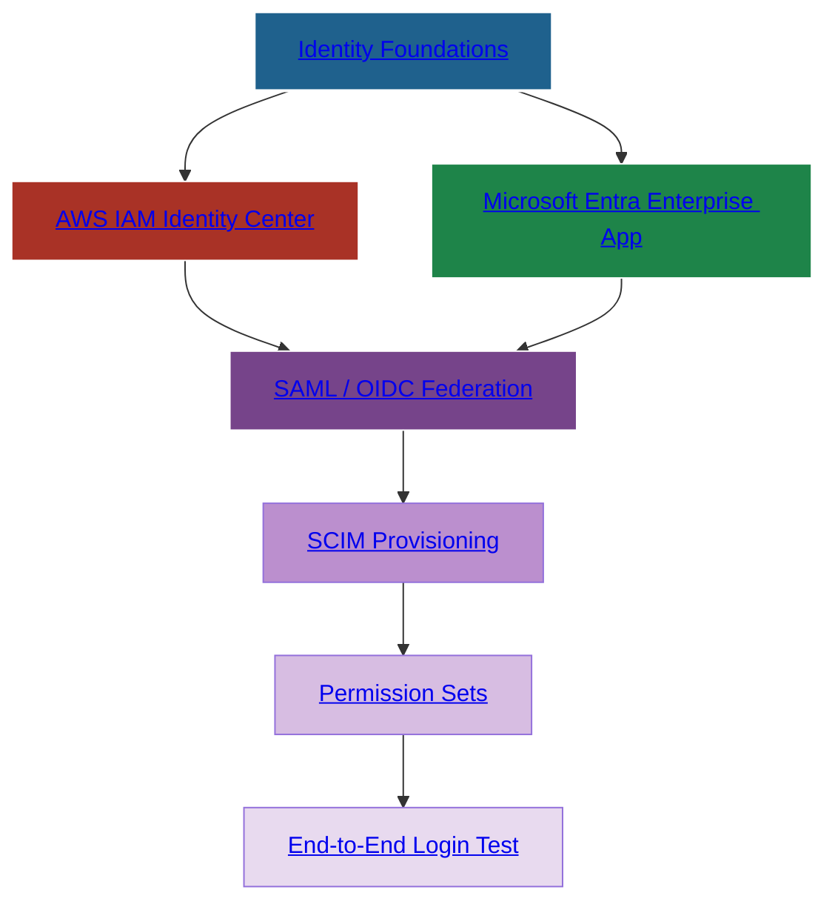

<div align="center">

# 🔐 SecureTheCloud Academy — Volume 1  
# **AWS IAM Identity Center ↔ Microsoft Entra ID Federation**  
### *Zero Trust Identity Layer*


🔗 **https://SecureTheCloud.dev**  
📺 **https://www.youtube.com/@SecureTheCloud-dev**

---

</div>

# 🌍 **What This Volume Covers**

This repository contains the **complete Zero Trust Identity Layer** of the SecureTheCloud curriculum.  
In this volume, you integrate:

### ⭐ Microsoft Entra ID (Azure AD)  
as the **central identity authority** for:

### ⭐ AWS IAM Identity Center (Formerly AWS SSO)

This provides:

- Unified login across AWS + Azure  
- SCIM user and group provisioning  
- Zero Trust MFA enforcement  
- Automatic least-privilege assignment  
- Enterprise-grade identity mapping  
- Removal of IAM users, passwords, and long-term keys  

---

# 🧭 **Curriculum Navigation (Chronological)**

### **⬅️ PREVIOUS VOLUME (Required)**  
**Volume 0 — Multi-Cloud Compute Architecture**  
https://github.com/S3curethecloud/multi-cloud-compute-architecture

### **➡️ NEXT VOLUME**  
Volume 2 — GCP Workforce Identity Federation *(coming soon)*

---

# 📂 **Repository Structure (Collapsible & Clickable)**

<details>
<summary><strong>📘 theory/ — Identity Federation Foundations</strong></summary>

1. [01 — Identity Foundations](theory/01-identity-foundations.md)  
2. [02 — AWS IAM Identity Center Overview](theory/02-aws-identity-center.md)  
3. [03 — Microsoft Entra ID Overview](theory/03-entra-id-overview.md)  
4. [04 — Federation Theory: SAML, OIDC, SCIM](theory/04-federation-theory.md)  
5. [05 — Zero Trust Identity Principles](theory/05-zero-trust-identity.md)  
6. [06 — Permission Sets & Enterprise RBAC](theory/06-permission-sets.md)

</details>

---

<details>
<summary><strong>🧪 labs/ — Hands-On Federation Labs</strong></summary>

1. [01 — Configure AWS IAM Identity Center](labs/01-aws-identity-center.md)  
2. [02 — Create Microsoft Entra Enterprise App](labs/02-entra-enterprise-app.md)  
3. [03 — Configure SCIM Provisioning](labs/03-scim-provisioning.md)  
4. [04 — Build AWS Permission Sets](labs/04-permission-sets.md)  
5. [05 — Azure Conditional Access for AWS Federation](labs/05-conditional-access.md)  
6. [06 — End-to-End Identity Federation Test](labs/06-end-to-end-test.md)

</details>

---

<details>
<summary><strong>🗺️ diagrams/ — Identity Architecture Maps</strong></summary>

- identity-flow.mmd  
- scim-provisioning.mmd  
- zero-trust-identity.mmd  
- permission-sets.mmd  
- authentication-sequence.mmd  

</details>

---

# 🧩 **Interactive Identity Federation Diagram (Clickable)**


🧠 What You Will Master in Volume 1
```plaintext
✔ Zero Trust Identity
✔ Identity Provider (IdP) vs Service Provider (SP)
✔ OIDC federation
✔ SAML bootstrap
✔ SCIM provisioning (Auto user + group sync)
✔ Permission Set architecture
✔ Enterprise RBAC mapping
✔ Entra Conditional Access
✔ Cross-cloud MFA enforcement
✔ Deleting IAM users permanently (best practice)
This is the core identity mesh that powers future volumes.

🛠️ Tools Used
Microsoft Entra ID (Azure AD)

AWS IAM Identity Center

SCIM 2.0

SAML 2.0

OIDC

Terraform (Optional automation layer)

Conditional Access Policies

AWS Permission Sets

Azure Enterprise Application

Azure Identity Governance

🔗 Return to Volume 0 (Flagship)
Multi-Cloud Compute Architecture
https://github.com/S3curethecloud/multi-cloud-compute-architecture

<div align="center">
SecureTheCloud.dev
Zero Trust • Multi-Cloud • Enterprise Architecture

</div> ```
