# 🧪 SecureTheCloud Academy — Volume 1  
## **Lab 01 — Configure AWS IAM Identity Center (SSO)**  
Zero Trust Identity Layer

---

📺 **Watch the Full Lab Walkthrough:**  
https://www.youtube.com/@SecureTheCloud-dev

---

```mermaid
flowchart TD

%% =============================
%% SECURETHECLOUD COLOR SYSTEM
%% =============================
classDef blue fill:#1F618D,stroke:#ffffff,color:white,font-weight:bold;
classDef gold fill:#F4B400,stroke:#ffffff,color:black;
classDef teal fill:#1ABC9C,stroke:#ffffff,color:black;
classDef grey fill:#BDC3C7,stroke:#2C3E50,color:black;
classDef orange fill:#E67E22,stroke:#ffffff,color:white;
classDef slate fill:#2C3E50,stroke:#ffffff,color:white;

%% =============================
%% ROOT NODE
%% =============================
A["<a href='../labs/01-aws-identity-center.md'>Lab 01 — Configure AWS IAM Identity Center (SSO)</a>"]:::blue

%% =============================
%% MAJOR STEPS
%% =============================
A --> B1["<a href='../labs/01-aws-identity-center.md#step-1-open-aws-identity-center'>Step 1 — Open AWS IAM Identity Center</a>"]:::gold
A --> B2["<a href='../labs/01-aws-identity-center.md#step-2-set-identity-source'>Step 2 — Set Identity Source</a>"]:::teal
A --> B3["<a href='../labs/01-aws-identity-center.md#step-3-configure-sso-settings'>Step 3 — Configure SSO Settings</a>"]:::orange
A --> B4["<a href='../labs/01-aws-identity-center.md#step-4-connect-entra-id'>Step 4 — Connect Entra ID</a>"]:::slate
A --> B5["<a href='../labs/01-aws-identity-center.md#step-5-test-login'>Step 5 — Test SSO Login</a>"]:::grey
A --> B6["<a href='../labs/02-entra-enterprise-app.md'>Next Lab — Configure Entra Enterprise App (SAML)</a>"]:::teal

%% =============================
%% STEP DETAILS (CLICKABLE)
%% =============================

%% STEP 1
B1 --> C1["<a href='https://console.aws.amazon.com/singlesignon'>AWS IAM Identity Center Console</a>"]:::gold
B1 --> C2["<a href='../theory/02-aws-identity-center-overview.md'>Understand Identity Center (Theory 02)</a>"]:::gold

%% STEP 2
B2 --> D1["<a href='../theory/04-federation-theory.md#identity-source'>Identity Source Theory</a>"]:::teal
B2 --> D2["<a href='../labs/03-scim-provisioning.md'>Prepare SCIM (Lab 03)</a>"]:::teal

%% STEP 3
B3 --> E1["<a href='../theory/04-federation-theory.md#saml'>SAML Basics (Theory 04)</a>"]:::orange
B3 --> E2["<a href='../theory/04-federation-theory.md#oidc'>OIDC Basics (Theory 04)</a>"]:::orange
B3 --> E3["<a href='../theory/06-permission-sets-rbac.md#session-settings'>Session Settings (Permission Sets)</a>"]:::orange

%% STEP 4
B4 --> F1["<a href='../labs/02-entra-enterprise-app.md'>Configure SAML App in Entra (Lab 02)</a>"]:::slate
B4 --> F2["<a href='../theory/03-azure-entra-overview.md'>Entra Enterprise Apps (Theory 03)</a>"]:::slate

%% STEP 5
B5 --> G1["<a href='../labs/01-aws-identity-center.md#validate-aws-console-access'>Validate AWS Console Access</a>"]:::grey
B5 --> G2["<a href='../labs/01-aws-identity-center.md#validate-cli-access'>Validate AWS CLI Access</a>"]:::grey

%% NEXT LAB LINK
B6 --> H1["<a href='../labs/02-entra-enterprise-app.md#step-1-create-enterprise-app'>Start Lab 02</a>"]:::teal
```

# 🎯 **Objective**

In this lab, you will:

- Enable **AWS IAM Identity Center (formerly AWS SSO)**
- Configure your initial identity settings
- Prepare AWS for external federation from Microsoft Entra ID (Azure AD)
- Locate the SCIM and SSO URLs needed in later labs
- Validate Identity Center is ready for federation

This is *required* before connecting Microsoft Entra ID in Lab 02.

---

# 🧩 **Prerequisites**

### ✔ AWS Root user (you are using this — good)  
### ✔ AWS Organizations is automatically enabled  
### ✔ No existing Identity Center configuration  
### ✔ Multi-Cloud Compute Layer (Volume 0) completed  

---

# 🚀 **Step 1 — Log in to AWS Console (Root Account)**

1. Open: https://console.aws.amazon.com  
2. Log in as **root user**  
3. Ensure you're in the **management account** (top right → AWS Account)

Expected:  
You see “My Organization” on the left sidebar.

---

# 🚀 **Step 2 — Navigate to AWS IAM Identity Center**

1. From AWS Console Home  
2. Search for:
3. 3. Click **IAM Identity Center**

You should see:

> **AWS IAM Identity Center (Active)**  
or  
> **Enable IAM Identity Center**

If you see “Enable” — continue below.

---

# 🚀 **Step 3 — Enable AWS IAM Identity Center**

1. Click **Enable IAM Identity Center**  
2. AWS will set up:  
   - Identity Center backend  
   - Required IAM roles  
   - Identity Store  
   - Console URL  

This takes ~10–20 seconds.

You should land on:

✔ **IAM Identity Center Dashboard**

---

# 🚀 **Step 4 — Configure Identity Source (VERY IMPORTANT)**

Identity Center defaults to:

Identity source: AWS IAM Identity Center directory

We will change this **in the next lab**.

For now, verify:

### Identity Source:  
✔ AWS IAM Identity Center (default)

### What this means:  
AWS is ready to **accept an external IdP**  
→ which will be **Microsoft Entra ID** (Lab 02)

---

# 🚀 **Step 5 — Locate the SCIM & SSO Metadata Values**

You will need these in Labs 02 & 03.

Navigate:

IAM Identity Center → Settings → Identity Source

Record these for later:

### 🔹 AWS SSO URL  
`https://<your-domain>.awsapps.com/start`

### 🔹 SCIM Endpoint  
`https://scim.<region>.amazonaws.com/scim/v2/`

### 🔹 SCIM Access Token  
(we generate this in Lab 03)

Keep these handy. Paste them into your notes or password manager.

*Never upload SCIM tokens to GitHub.*

---

# 🚀 **Step 6 — Validate Identity Center Region**

Identity Center is single-region.

Verify region in the top-right dropdown:

Region: us-east-1 (or your preferred region)

### Recommendation  
Use the same region where:

- Your AWS workloads exist  
- Most of your IAM operations occur  
- You will perform federation testing  

---

# 🚀 **Step 7 — Validate Identity Center Is Working**

Go to:

IAM Identity Center → Dashboard

You should see:

- **Users** (empty or minimal)
- **Groups** (empty)
- **Applications** (none yet)
- **AWS Accounts** → The OU/account list

If everything loads → Identity Center is ready.

---

# 🧪 **Lab Completion Checklist**

✔ IAM Identity Center is enabled  
✔ Region is confirmed  
✔ SSO URL captured  
✔ SCIM endpoint captured  
✔ No errors in dashboard  
✔ AWS ready to accept external IdP federation  

---

# 🚀 Next Lab  
➡️ **Lab 02 — Create Microsoft Entra Enterprise App**  
[02-entra-enterprise-app.md](02-entra-enterprise-app.md)

⬅️ Back to Theory  
[01-identity-foundations.md](../theory/01-identity-foundations.md)

---

# 🔙 Back to Volume 1 README  
https://github.com/S3curethecloud/multi-cloud-identity-aws-entra

---

# 🧭 SecureTheCloud Footer

**© 2025 SecureTheCloud.dev — All Rights Reserved**  
Zero Trust • Multi-Cloud • Enterprise Architecture  

[Terms](https://securethecloud.dev/terms) •  
[Privacy](https://securethecloud.dev/privacy) •  
[Status](https://securethecloud.dev/status) •  
[Community](https://t.me/SecureTheCloud) •  
[Docs](https://securethecloud.dev/docs)

