# 🧪 SecureTheCloud Academy — Volume 1  
## **Lab 02 — Create Microsoft Entra Enterprise App (AWS Federation)**  
Zero Trust Identity Layer

---

📺 **Watch the Full Lab Walkthrough:**  
https://www.youtube.com/@SecureTheCloud-dev

---

```mermaid
flowchart TD

%% =============================
%% SECURETHECLOUD COLOR SYSTEM
%% =============================
classDef blue fill:#1F618D,stroke:#ffffff,color:white,font-weight:bold;
classDef gold fill:#F4B400,stroke:#ffffff,color:black;
classDef teal fill:#1ABC9C,stroke:#ffffff,color:black;
classDef slate fill:#2C3E50,stroke:#ffffff,color:white;
classDef grey fill:#BDC3C7,stroke:#2C3E50,color:black;
classDef orange fill:#E67E22,stroke:#ffffff,color:white;

%% =============================
%% ROOT NODE
%% =============================
A["<a href='../labs/02-entra-enterprise-app.md'>Lab 02 — Entra Enterprise Application<br/>for AWS SSO Federation</a>"]:::blue

%% =============================
%% HIGH-LEVEL STEPS
%% =============================
A --> B1["<a href='../labs/02-entra-enterprise-app.md#step-1-create-enterprise-application'>Step 1 — Create Enterprise App</a>"]:::gold
A --> B2["<a href='../labs/02-entra-enterprise-app.md#step-2-configure-saml'>Step 2 — Configure SAML</a>"]:::teal
A --> B3["<a href='../labs/02-entra-enterprise-app.md#step-3-download-metadata'>Step 3 — Metadata Exchange</a>"]:::orange
A --> B4["<a href='../labs/02-entra-enterprise-app.md#step-4-assign-users'>Step 4 — Assign Users/Groups</a>"]:::slate
A --> B5["<a href='../labs/02-entra-enterprise-app.md#step-5-test-sso'>Step 5 — Test SSO (SAML)</a>"]:::grey
A --> B6["<a href='../labs/03-scim-provisioning.md'>Next Lab — SCIM Provisioning</a>"]:::teal

%% =============================
%% STEP 1 — CREATE APP
%% =============================
B1 --> C1["<a href='https://entra.microsoft.com/#view/Microsoft_AAD_IAM/ConnectedAppsBlade'>Open Entra Enterprise Apps</a>"]:::gold
B1 --> C2["<a href='../theory/03-azure-entra-overview.md#enterprise-applications'>Enterprise App Theory (Ch. 03)</a>"]:::gold

%% =============================
%% STEP 2 — CONFIGURE SAML
%% =============================
B2 --> D1["<a href='../theory/04-federation-theory.md#saml'>What is SAML?</a>"]:::teal
B2 --> D2["<a href='../labs/02-entra-enterprise-app.md#edit-basic-saml-configuration'>Edit Basic SAML Configuration</a>"]:::teal
B2 --> D3["<a href='../theory/04-federation-theory.md#acs-url'>AWS ACS URL</a>"]:::teal
B2 --> D4["<a href='../theory/04-federation-theory.md#entity-id'>AWS Entity ID</a>"]:::teal
B2 --> D5["<a href='../theory/04-federation-theory.md#sso-url'>SSO URL (AWS)</a>"]:::teal

%% =============================
%% STEP 3 — METADATA EXCHANGE
%% =============================
B3 --> E1["<a href='../labs/02-entra-enterprise-app.md#download-entra-metadata'>Download Entra Metadata</a>"]:::orange
B3 --> E2["<a href='../labs/01-aws-identity-center.md#upload-idp-metadata'>Upload Metadata to AWS</a>"]:::orange
B3 --> E3["<a href='../theory/04-federation-theory.md#idp-metadata'>IdP Metadata Theory</a>"]:::orange
B3 --> E4["<a href='../theory/04-federation-theory.md#sp-metadata'>SP Metadata Theory</a>"]:::orange

%% =============================
%% STEP 4 — ASSIGN USERS
%% =============================
B4 --> F1["<a href='../labs/02-entra-enterprise-app.md#add-users-groups'>Add Users/Groups</a>"]:::slate
B4 --> F2["<a href='../labs/03-scim-provisioning.md'>SCIM Group/Identity Sync</a>"]:::slate
B4 --> F3["<a href='../theory/06-permission-sets-rbac.md#group-role-mapping'>Group → Role Mapping</a>"]:::slate

%% =============================
%% STEP 5 — TEST SSO
%% =============================
B5 --> G1["<a href='../theory/04-federation-theory.md#test-flow'>SAML Auth Flow (Theory)</a>"]:::grey
B5 --> G2["<a href='https://aws.amazon.com/iam/identity-center/'>AWS IAM Identity Center Docs</a>"]:::grey
B5 --> G3["<a href='../labs/01-aws-identity-center.md#validate-aws-console-access'>Validate Console Login</a>"]:::grey
B5 --> G4["<a href='../labs/01-aws-identity-center.md#validate-cli-access'>Validate CLI Login</a>"]:::grey
```

# 🎯 **Objective**

In this lab, you will configure:

- A **Microsoft Entra Enterprise Application** for AWS IAM Identity Center  
- Federation (SAML 2.0) from Entra → AWS  
- Token/claim settings for AWS  
- User/group assignment for SSO testing  
- Metadata exchange required for federation  
- Preparation for SCIM provisioning (Lab 03)

This is the *core* step in enabling Zero Trust authentication for AWS.

---

# 🧩 **Prerequisites**

Before starting, you must have completed:

### ✔ Lab 01 — Configure AWS IAM Identity Center  
### ✔ Volume 0 — Multi-Cloud Compute Layer  
### ✔ Entra ID Admin permissions  
### ✔ AWS SSO URL (captured in Lab 01)  
### ✔ AWS Region (confirm: `us-east-1` or your selected region)

---

# 🚀 **Step 1 — Sign in to Microsoft Entra Admin Center**

1. Open:  
   https://entra.microsoft.com  
2. Sign in with your **Global Admin** or **Application Administrator** account  
3. Confirm you're in the correct tenant:  
   **Tenant ID:** `776f9ea5-7add-469d-bc51-8e855e9a1d26`

Expected:

- Left sidebar shows **Identity**, **Applications**, **Users**, **Groups**

---

# 🚀 **Step 2 — Go to Enterprise Applications**

1. From left menu:  
   **Identity → Applications → Enterprise applications**
2. Click **+ New application**
3. Select: **Create your own application**

You will see a dialog:

> **Name your application**

Enter:

Integrate any other application you don’t find in the gallery (Non-gallery)

Click **Create**.

---

# 🚀 **Step 3 — Configure Single Sign-On (SAML)**

1. In your newly created Enterprise App, click:  
   **Single sign-on**
2. Select **SAML**

You will see four main SAML configuration blocks.

---

# 🚀 **Step 4 — Edit Basic SAML Configuration**

Click **Edit** under *Basic SAML Configuration*.

You need to enter:

### 1️⃣ **Identifier (Entity ID)**  
From AWS console:

IAM Identity Center → Settings → Identity Source

Copy:

AWS SSO SAML Metadata Entity ID

Example:

urn:amazon:webservices

### 2️⃣ **Reply URL (ACS URL)**  
Copy from AWS:

AWS SSO ACS URL

Example:

https://<your-domain>.awsapps.com/start

### 3️⃣ **Sign-on URL**  
Optional, but recommended:

https://<your-domain>.awsapps.com/start

Click **Save**.

---

# 🚀 **Step 5 — Download the Microsoft Entra SAML Certificate**

Under:

SAML Certificates

Download:

- **Certificate (Base64)** → required for AWS

Record:

- Thumbprint  
- Expiration date  

---

# 🚀 **Step 6 — Configure User Attributes & Claims**

Click **Edit** under *Attributes & Claims*.

Default claims include:

- `email`  
- `given_name`  
- `surname`  

You MUST add:

### ➕ **Claim: "role"**  
AWS uses this for group → permission mapping.

Click:

Add claim

Enter:

- **Name:** `role`  
- **Source:** `Attribute`  
- **Value:** `user.assignedroles`  

Click **Save**.

---

# 🚀 **Step 7 — Assign Test User or Group**

1. Left menu → **Users and groups**  
2. Click **+ Add user/group**  
3. Assign one test user for now  

This user should exist in:

- Microsoft Entra ID  
- Not yet synced to AWS (SCIM comes in Lab 03)

This user will be used to **test SSO** later.

---

# 🚀 **Step 8 — Provide AWS With Microsoft Entra Metadata**

You will need to upload your Entra app metadata to AWS.

Download:

Federation Metadata XML

File name example:

metadata.xml

You will upload this in the next lab.

---

# 🚀 **Step 9 — Record These Values for Lab 03**

From your Enterprise App → Single Sign-On page:

### 🔹 Login URL  
### 🔹 Application (Entity ID)  
### 🔹 SAML Certificate (Base64)  
### 🔹 Federation Metadata XML  

These values are required for SCIM + full federation configuration.

Store them securely.

---

# 🧪 **Lab Completion Checklist**

✔ Enterprise Application created  
✔ SAML configured  
✔ Certificate downloaded  
✔ Attribute/Claim edited  
✔ Test user assigned  
✔ Metadata XML downloaded  
✔ AWS metadata values ready  

This completes the federation configuration portion.

---

# 🚀 Next Lab  
➡️ **Lab 03 — Configure SCIM Provisioning (Entra → AWS)**  
*(Coming next — click below when generated)*

⬅️ Back to Lab 01  
[01-aws-identity-center.md](01-aws-identity-center.md)

---

# 🔙 Back to Volume 1 README  
https://github.com/S3curethecloud/multi-cloud-identity-aws-entra

---

# 🧭 SecureTheCloud Footer

**© 2025 SecureTheCloud.dev — All Rights Reserved**  
Zero Trust • Multi-Cloud • Enterprise Architecture  

[Terms](https://securethecloud.dev/terms) •  
[Privacy](https://securethecloud.dev/privacy) •  
[Status](https://securethecloud.dev/status) •  
[Community](https://t.me/SecureTheCloud) •  
[Docs](https://securethecloud.dev/docs)

