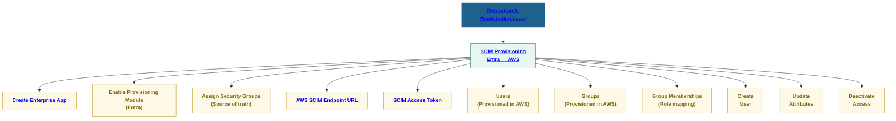

# **SecureTheCloud Identity Academy — Volume 1**
### **AWS IAM Identity Center ↔ Microsoft Entra Federation**

🔗 https://SecureTheCloud.dev  
📺 https://www.youtube.com/@SecureTheCloud-dev  

---

🧭 Lab Objective

In this lab, you will configure:

✔ SCIM Provisioning in Microsoft Entra
✔ Automatic User + Group Sync to AWS
✔ Mapping Entra Security Groups → AWS Permission Assignments
✔ Validating user propagation
✔ Testing identity lifecycle (Create, Update, Deactivate action)

This enables AWS IAM Identity Center to receive:

Users (identity objects)

Groups (role containers)

Memberships (authorization relationship)

Lifecycle Actions (create/update/delete)

This is critical for Zero Trust because:

Identity must flow from IdP → SP consistently and automatically.
No manual IAM users. No drift. No shadow identities.

🧩 Clickable SCIM Provisioning Diagram
Every box below is clickable and links to the correct folder or lab.

---
🧰 Prerequisites

✔ Lab 01 — AWS IAM Identity Center (SSO)
✔ Lab 02 — Create Enterprise App (SAML Federation)
✔ SCIM URL + Access Token from AWS Identity Center
✔ Azure admin access
✔ At least one Entra security group created (e.g., AWS-Developers)

---

🚀 Step 1 — Open the Enterprise App in Microsoft Entra

Visit:
https://entra.microsoft.com

Navigate to:
Identity → Applications → Enterprise Applications

Select the app you created in Lab 02:
AWS IAM Identity Center — SecureTheCloud

You should now be on the Overview page.

🚀 Step 2 — Open the Provisioning Blade

In the left menu, click:
Provisioning

Under Provisioning Mode, select:

Automatic

This tells Entra:
➡ "I will sync objects into AWS automatically using SCIM."

🚀 Step 3 — Enter the SCIM Configuration

From AWS IAM Identity Center → Settings → Identity Source, copy:

SCIM Endpoint

SCIM Access Token

Paste into Entra:

Setting	Value
Tenant URL	SCIM Endpoint
Secret Token	SCIM Access Token

Click Test Connection

💡 Expected result:

Connection succeeded.

If it fails:

Token expired → regenerate in AWS

Wrong region → ensure us-east-1 (or your chosen region)

Wrong endpoint → ensure it ends in /scim/v2

🚀 Step 4 — Configure Attribute Mappings

Scroll to Mappings

Configure:

User Mapping
Entra Attribute	AWS SCIM Equivalent
displayName	name
mail	userName
givenName	givenName
surname	familyName
objectId	externalId
accountEnabled	active
Group Mapping
Entra Attribute	AWS Equivalent
displayName	displayName
objectId	externalId
members	members

Click Save.

🚀 Step 5 — Assign Security Groups (Source of Truth)

Navigate to:

Enterprise App → Users and Groups

Click:

+ Add user/group

Add:

Your test admin group

A production group (e.g., AWS-Developers)

Your own test user

This defines:

“Which identities should be synced to AWS?”

🚀 Step 6 — Start Provisioning Job

Go back to:

Provisioning → Overview

Click:

Start provisioning

The first sync takes 5–15 minutes.

You can monitor progress in:

Provisioning Logs

🚀 Step 7 — Validate Sync in AWS IAM Identity Center

Go to:

AWS Console → IAM Identity Center → Users

You should see:

✔ Users from Entra synced
✔ Groups synced
✔ Membership mapped

If not:

Fix checklist:

Entra admin consent missing

Missing attribute mappings

Group missing members

Token expired

SCIM service disabled

🧪 Step 8 — Test Identity Lifecycle
1️⃣ Create

Create a new user in Entra → sync to AWS

2️⃣ Update

Change user’s displayName → should update in AWS

3️⃣ Deactivate

Disable user in Entra → AWS should set active=false

4️⃣ Remove group membership

User loses role → AWS removes assignments

This confirms your federation + provisioning workflow is healthy.

📦 Lab Completion Checklist

✔ SCIM connection tested
✔ User mapping correct
✔ Group mapping correct
✔ Provisioning logs successful
✔ Users appear in AWS IAM Identity Center
✔ Groups appear in AWS
✔ Lifecycle events propagate

⏭️ Next Lab

➡ Lab 04 — Permission Set Assignment (RBAC at Scale)
👉 04-permission-sets.md

Return to Theory:
➡ ../theory/06-permission-sets-rbac.md
---

### **© 2025 SecureTheCloud — All Rights Reserved**
Zero Trust • Cloud Security • Multi-Cloud Architecture

