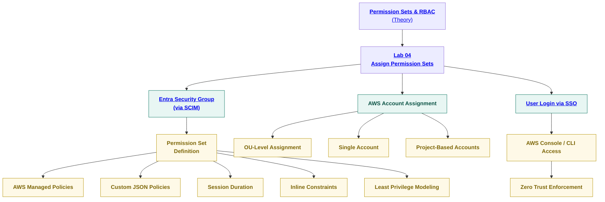

🧩 SecureTheCloud Academy — Volume 1
Lab 04 — Permission Sets & Enterprise RBAC
AWS IAM Identity Center ↔ Microsoft Entra Federation

 

🔗 https://SecureTheCloud.dev

📺 https://www.youtube.com/@SecureTheCloud-dev

🎯 Lab Objective

In this lab, you will configure authorization for your federated environment by mapping:

✔ Entra Security Groups →

✔ AWS Permission Sets →

✔ AWS Accounts (OU-level or individual)

This is where real enterprise RBAC becomes operational.

Identity Flow Summary

Component	Purpose
SCIM	Syncs users & groups
SAML/OIDC	Authenticates identity
Permission Sets	Authorizes access
AWS Roles	Enforce permissions in accounts

This lab turns Entra groups into real AWS roles.

🧩 Fully Clickable RBAC Diagram

All items below are clickable and route to theory or labs.

🧰 Prerequisites

Before starting this lab, ensure:

✔ Lab 01 — AWS IAM Identity Center configured

✔ Lab 02 — Entra Enterprise App (SAML) completed

✔ Lab 03 — SCIM Provisioning working

✔ Entra groups synced successfully

✔ AWS Organizations connected with at least one account

🚀 Step 1 — View Synced Groups in AWS

Navigate:

IAM Identity Center → Groups

You should now see groups synced from Entra:

AWS-Developers

AWS-Admins

AWS-ReadOnly

Any additional custom groups

These arrived through SCIM from Lab 03.

🚀 Step 2 — Create a Permission Set

Navigate:

IAM Identity Center → Permission Sets → Create Permission Set

You now choose between:

⭐ Option A — AWS Managed Policies

Use this for:

Developers

Viewers

Admins

Billing teams

Examples:

ReadOnlyAccess

PowerUserAccess

AdministratorAccess

⭐ Option B — Custom Permission Sets (Recommended)

Click:

Create a custom permission set

Recommended configuration:

Setting	Recommendation
Name	stc-dev-ps, stc-admin-ps
Session Duration	1 hour (Zero Trust)
Relay State	Default
Permissions	Custom JSON policy
Example Least Privilege Dev Policy
{
  "Version": "2012-10-17",
  "Statement": [
    { "Effect": "Allow", "Action": ["ec2:Describe*"], "Resource": "*" },
    { "Effect": "Allow", "Action": ["logs:Describe*","logs:Get*","logs:List*"], "Resource": "*" }
  ]
}

🚀 Step 3 — Assign Permission Set to Entra Group

Navigate:

IAM Identity Center → AWS Account Assignments

Click:

Assign users or groups

Choose:

Group: AWS-Developers

Accounts: Select one or many

Permission Set: stc-dev-ps

Click Submit.

This action creates:

An AWS role matching the permission set

A trust policy

A full group → permission → account binding

🚀 Step 4 — Validate Role Creation in AWS

Navigate:

IAM → Roles

You should now see roles like:

AWSReservedSSO_stc-dev-ps_xxxxx

AWSReservedSSO_stc-admin-ps_xxxxx

AWSReservedSSO_ReadOnlyAccess_xxxxx

⚠️ Never modify trust policies manually.
They are fully managed by IAM Identity Center.

🚀 Step 5 — Test User Login via SSO

Visit your SSO portal:

https://<your-domain>.awsapps.com/start

Sign in using Entra credentials (from Lab 02).

Expected results:

Assigned roles visible

You can assume roles

Permissions match permission sets

Session enforces your configured duration

🚀 Step 6 — Validate Least Privilege
Developer Role

✔ Can view EC2

✔ Can view logs

✖ Cannot delete EC2

✖ Cannot modify IAM

ReadOnly Role

✔ View-only across services

✖ Cannot modify resources

Admin Role

✔ Full access

🔐 MFA enforced via Entra Conditional Access

🚦 Step 7 — Enterprise RBAC Patterns (SecureTheCloud Standard)

Choose the best scaling model for enterprise:

1️⃣ Functional RBAC

AWS-Dev

AWS-Ops

AWS-Security

2️⃣ Environment-Based RBAC

AWS-DevOps-Sandbox

AWS-Prod-Operations

AWS-Stage-Developers

3️⃣ Project-Based RBAC

AWS-ProjectA-Developers

AWS-ProjectB-DataScience

4️⃣ Break-Glass Admin

AWS-Emergency-Admin
⚠️ Requires MFA + short sessions + alerts

📦 Lab Completion Checklist
Task	Status
Permission Sets created	✔
Groups mapped to accounts	✔
Roles created	✔
SSO login validated	✔
Least privilege enforced	✔
Zero Trust identity behavior verified	✔
⏭️ Next Steps

➡ Chapter 06 — Permission Sets & RBAC Theory
📄 ../theory/06-permission-sets-rbac.md

⬅ Back to all theory:
📄 ../theory/01-identity-foundations.md

⬅ Back to Volume README
📄 ../README.md

🧭 SecureTheCloud Footer

 

© 2025 SecureTheCloud.dev — All Rights Reserved
Zero Trust • Multi-Cloud • Enterprise Architecture

Terms
 •
Privacy
 •
Status
 •
Community
 •
Docs

