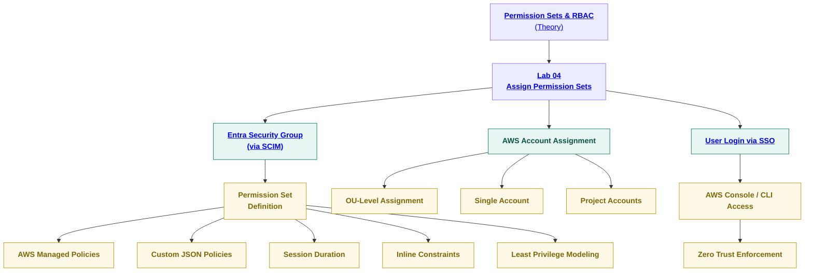

# 🧩 SecureTheCloud Academy — Volume 1  
## **Lab 04 — Permission Sets & Enterprise RBAC**  
### **AWS IAM Identity Center ↔ Microsoft Entra Federation**

---

<div align="center">


<br/>

🔗 **https://SecureTheCloud.dev**  
📺 **https://www.youtube.com/@SecureTheCloud-dev**

</div>

---

# 🎯 Lab Objective

In this lab, you will configure **authorization** for your federated identity platform by mapping:

- ✔ Entra **Security Groups**  
- ✔ AWS **Permission Sets**  
- ✔ AWS **Accounts / OUs**

This is where **enterprise-grade RBAC** becomes real.

### **Identity Flow Summary**

| Component | Purpose |
|----------|---------|
| **SCIM** | Syncs users/groups from Entra |
| **SAML/OIDC** | Authenticates identities |
| **Permission Sets** | Authorizes access |
| **AWS Roles** | Enforce permissions inside accounts |

This lab **turns Entra groups into real AWS roles**.

---

# 🧩 Fully Clickable RBAC Diagram


---
🧰 Prerequisites

✔ Lab 01 — IAM Identity Center

✔ Lab 02 — Entra Enterprise App (SAML)

✔ Lab 03 — SCIM Provisioning

✔ Groups synced successfully

✔ One or more AWS accounts in Organizations

🚀 Step 1 — View Synced Groups

Navigate:

IAM Identity Center → Groups


You should see:

AWS-Developers

AWS-Admins

AWS-ReadOnly

Any custom groups

These were synced in Lab 03 — SCIM Provisioning.

🚀 Step 2 — Create a Permission Set

Navigate:

IAM Identity Center → Permission Sets → Create Permission Set


Choose one:

⭐ Option A — AWS Managed Policies

Examples:

ReadOnlyAccess

PowerUserAccess

AdministratorAccess

⭐ Option B — Custom Permission Set (recommended)

Click:

Create a custom permission set


Recommended:

Setting	Value
Name	stc-dev-ps, stc-admin-ps
Session Duration	1 hour
Relay State	Default
Permissions	Custom JSON

Example Least Privilege Dev Policy

{
  "Version": "2012-10-17",
  "Statement": [
    { "Effect": "Allow", "Action": ["ec2:Describe*"], "Resource": "*" },
    { "Effect": "Allow", "Action": ["logs:Describe*","logs:Get*","logs:List*"], "Resource": "*" }
  ]
}

🚀 Step 3 — Assign Permission Set to Group

Navigate:

IAM Identity Center → AWS Account Assignments


Click:

Assign users or groups


Select:

Group: AWS-Developers

Accounts: one or many

Permission Set: stc-dev-ps

Click Submit.

AWS automatically creates:

The IAM Role

Trust policy

Permission boundaries

🚀 Step 4 — Validate AWS Role Creation

Navigate:

IAM → Roles


You should see:

AWSReservedSSO_stc-dev-ps_xxxxx

AWSReservedSSO_stc-admin-ps_xxxxx

⚠ Do NOT edit trust policies — IAM Identity Center manages them.

🚀 Step 5 — Test Login via SSO

Visit:

https://<your-domain>.awsapps.com/start


Login using Entra ID.

Expected:

Your assigned roles appear

You can assume multiple roles

Session duration matches your Permission Set

🚀 Step 6 — Validate Least Privilege
Developer Role

✔ Can view EC2

✔ Can read logs

✖ Cannot delete EC2

✖ Cannot modify IAM

ReadOnly Role

✔ View-only across AWS

Admin Role

✔ Full administrator access

🔐 Conditional Access enforcement

🚦 Step 7 — Enterprise RBAC Patterns (Best Practice)
1️⃣ Functional RBAC

AWS-Dev

AWS-Ops

AWS-Security

2️⃣ Environment-Based RBAC

AWS-Prod-Operations

AWS-Stage-Developers

AWS-DevOps-Sandbox

3️⃣ Project RBAC

AWS-ProjectA-Developers

AWS-ProjectB-DataScience

4️⃣ Break-Glass

AWS-Emergency-Admin

📦 Lab Completion Checklist

✔ Permission Sets created

✔ Group assignment completed

✔ Roles auto-created

✔ SSO login validated

✔ Least privilege enforced

✔ Zero Trust identity posture verified

⏭ Next Steps

➡ Permission Sets & RBAC Theory
../theory/06-permission-sets-rbac.md

⬅ Back to Identity Foundations
../theory/01-identity-foundations.md

⬅ Back to Volume README
../README.md

<div align="center"> 

© 2025 SecureTheCloud.dev — All Rights Reserved
Zero Trust • Multi-Cloud • Enterprise Architecture

Terms
 •
Privacy
 •
Status
 •
Community
 •
Docs

</div> ```
