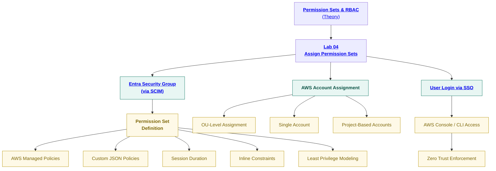

# **SecureTheCloud Identity Academy — Volume 1**
### **AWS IAM Identity Center ↔ Microsoft Entra Federation
Permission Set Assignment + Enterprise RBAC**

🔗 https://SecureTheCloud.dev  
📺 https://www.youtube.com/@SecureTheCloud-dev  

---

🎯 Lab Objective

In this lab, you will:

✔ Assign AWS Permission Sets to Entra Groups
✔ Enforce least privilege at scale
✔ Bind identity → group → permission → AWS account
✔ Validate role assumption via Identity Center
✔ Implement Zero Trust identity → authorization flows
✔ Map team roles (Dev/Ops/Security)

This is where authorization happens in SecureTheCloud.

SCIM = sync identities
SAML/OIDC = authenticate identities
Permission Sets = authorize identities

This lab turns your Entra groups into real AWS roles.

🧩 Fully Clickable Permission Sets Diagram

Everything below is clickable and maps to labs or theory pages.

🧰 Prerequisites

✔ Lab 01 — AWS IAM Identity Center
✔ Lab 02 — Entra Enterprise App (SAML)
✔ Lab 03 — SCIM Provisioning
✔ Groups synced successfully
✔ At least one AWS account enrolled in AWS Organizations

🚀 Step 1 — View Synced Groups From Entra

Navigate to AWS Console:

IAM Identity Center → Groups

You should see:

AWS-Developers

AWS-Admins

AWS-ReadOnly

Any custom security groups you created

These groups arrived via SCIM in Lab 03.

🚀 Step 2 — Create a Permission Set

Navigate:

IAM Identity Center → Permission Sets → Create Permission Set

Choose a method:

Option A — AWS Managed Policies

Great for:

Developers

Viewers

Admins

Billing teams

Examples:

ReadOnlyAccess

PowerUserAccess

AdministratorAccess

Option B — Custom Permissions (recommended)

Click:

Create a custom permission set

Define:

Setting	Recommendation
Name	stc-dev-ps, stc-admin-ps
Session Duration	1 hour (Zero Trust)
Relay State	Default
Permissions	custom JSON policy

Example least-privilege dev JSON:

{
  "Version": "2012-10-17",
  "Statement": [
    { "Effect": "Allow", "Action": ["ec2:Describe*"], "Resource": "*" },
    { "Effect": "Allow", "Action": ["logs:Describe*","logs:Get*","logs:List*"], "Resource": "*" }
  ]
}

🚀 Step 3 — Assign Permission Set to Group

Navigate:

IAM Identity Center → AWS Account Assignments

Click:

Assign users or groups

Choose:

Group: AWS-Developers

Accounts: (Select one or multiple)

Permission Set: stc-dev-ps

Click Submit.

This creates:

A role for the permission set

A trust relationship

Group-based authorization mapping

🚀 Step 4 — Validate Role Creation in AWS Account

Open AWS Console:

IAM → Roles

You should see roles such as:

AWSReservedSSO_stc-dev-ps_xxxxx

AWSReservedSSO_stc-admin-ps_xxxxx

AWSReservedSSO_ReadOnlyAccess_xxxxx

These are managed automatically by AWS IAM Identity Center.

Do NOT modify trust policies manually.

🚀 Step 5 — Test Login Using SSO

Visit your Identity Center URL:

https://<your-domain>.awsapps.com/start

Login using Entra credentials (Lab 02 SAML flow).

Expected:

All roles bound to your groups appear

You can assume roles

Your permissions match the Permission Set

Session lasts exactly as configured

🚀 Step 6 — Validate Least Privilege

Perform tests:

Developer role

Can view EC2

Cannot delete EC2

Can retrieve logs

Cannot modify IAM

ReadOnly role

Should not be able to modify anything

Can view resources across AWS

Admin role

Full permissions

MFA enforcement via Entra & Conditional Access

🚦 Step 7 — RBAC Scaling Patterns (SecureTheCloud Best Practices)

Use these patterns for real enterprise:

1️⃣ Functional

AWS-Dev

AWS-Ops

AWS-Security

2️⃣ Environment

AWS-DevOps-Sandbox

AWS-Prod-Operations

AWS-Stage-Developers

3️⃣ Project-Based

AWS-ProjectA-Developers

AWS-ProjectB-DataScience

4️⃣ Break-Glass

AWS-Emergency-Admin
⚠️ Requires MFA + short session + alerts

📦 Lab Completion Checklist

✔ Permission Sets created
✔ Groups mapped to accounts
✔ Roles created inside AWS accounts
✔ SSO login validated
✔ Least privilege behavior validated
✔ Zero Trust policy enforcement observed

⏭️ Next Steps

Continue to:

➡ Chapter 06 — Permission Sets & RBAC Theory
👉 ../theory/06-permission-sets-rbac.md

Return to all theory:
👉 ../theory/01-identity-foundations.md

Return to Volume README:
👉 ../README.md

© 2025 SecureTheCloud.dev — All Rights Reserved
Zero Trust • Multi-Cloud • Enterprise Architecture

Terms
 •
Privacy
 •
Status
 •
Community
 •
Docs

