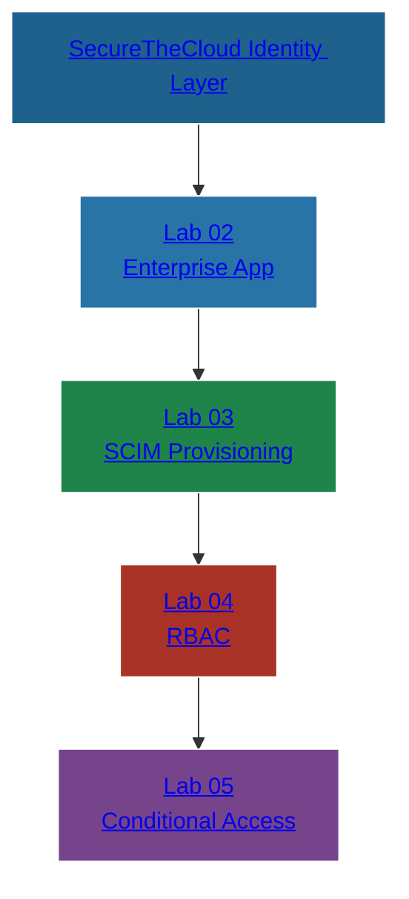

📘 LAB 05 — Conditional Access (Microsoft Entra Zero Trust Policies)
SecureTheCloud Identity Federation Academy — Volume 1

🔗 Interactive Identity Architecture Map (Clickable)

(Matches style from Labs 01–04 exactly)

🎯 Objective

Apply Zero Trust Conditional Access policies to AWS IAM Identity Center sign-ins using Microsoft Entra ID.

By the end of this lab, you will:

Create a Conditional Access policy scoped to AWS SSO

Enforce MFA

Enforce compliant/trusted devices (optional)

Block risky sign-ins

Block legacy authentication

Configure Zero Trust session enforcement

Validate the policy using sign-in logs

🧩 Prerequisites
✔ Identity Federation Labs 01–04 completed
✔ SCIM provisioning functioning
✔ Entra enterprise app created and assigned
✔ Test user + test group provisioned
✔ Admin access to Entra Conditional Access
#️⃣ Step 1 — Open the AWS Enterprise App in Entra

Go to: https://entra.microsoft.com

Navigate:

Identity → Applications → Enterprise Applications

Select:

AWS IAM Identity Center (SecureTheCloud)

This is the same app created in Lab 02.

#️⃣ Step 2 — Create a Conditional Access Policy

Go to:

Identity → Protection → Conditional Access

Click:

+ New policy

Name it:

STC-AWS-Federation-ZeroTrust

We use strict, enterprise naming conventions.

#️⃣ Step 3 — Assign Target Users

Select:

Users → Select groups

Choose only:

SecureTheCloud-Admins
SecureTheCloud-Developers
SecureTheCloud-Auditors

⚠️ Do NOT apply this policy to All Users (yet).
This prevents locking yourself out.

#️⃣ Step 4 — Scope the Policy to AWS SSO

Under Cloud Apps:

Click:

Select apps

Choose:

AWS IAM Identity Center (SecureTheCloud)

This ensures CA only triggers when authenticating into AWS.
#️⃣ Step 5 — Configure Zero Trust Conditions
🔸 Sign-in Risk

Under Conditions → Sign-in Risk:

High → Block access

🔸 Device Platforms (Optional)
Include: All platforms
Exclude: iOS/Android (optional)

🔸 Locations
Include: All locations
Exclude: Trusted locations

🔸 Client Apps
Block legacy authentication: Enabled

Legacy auth is a major Zero Trust violation.

#️⃣ Step 6 — Enforce Zero Trust Grant Controls

Under Grant:

Check:
✔ Require multifactor authentication
✔ Require device to be marked as compliant (optional)
✔ Require hybrid Azure AD joined device (optional)
✔ Require password change if risk detected (optional)

Required minimum:

MFA

Always.

#️⃣ Step 7 — Session Controls (Zero Trust Token Hardening)

Go to Session:

✔ Sign-in frequency → Every 8 hours
✔ Persistent browser session → Never persistent

Short sessions reduce risk of stolen tokens being reused.

#️⃣ Step 8 — Set Policy to Report-Only

ALWAYS test CA policies before enforcing.

Set:

Enable policy → Report-only

Click Save.

#️⃣ Step 9 — Validate Sign-In Logs

Go to:

Identity → Monitoring → Sign-in logs

Filter by application:

AWS IAM Identity Center

You should see:

MFA requirement detected

Policy listed under Report-only

Risk evaluated

Device compliance evaluated

Redirect to AWS SSO completed

#️⃣ Step 10 — Enable the Policy

Once validation is complete:

Go back to the CA policy

Change:

Enable policy → On

Click Save

AWS federation now fully enforces Zero Trust Identity Access.

🧪 Lab Completion Checklist
Requirement	Status
CA policy created	✔
Targets AWS SSO only	✔
MFA enforced	✔
Legacy auth blocked	✔
Risk policies applied	✔
Session controls applied	✔
Verified via sign-in logs	✔
Policy enabled	✔
🔗 Next Lab →

👉 Lab 06 — End-to-End SSO Login Test
./06-end-to-end-sso.md

🔙 Back to Lab 04 →

./04-permission-sets.md

© 2025 SecureTheCloud.dev — All Rights Reserved
Zero Trust • Multi-Cloud • Enterprise Architecture

