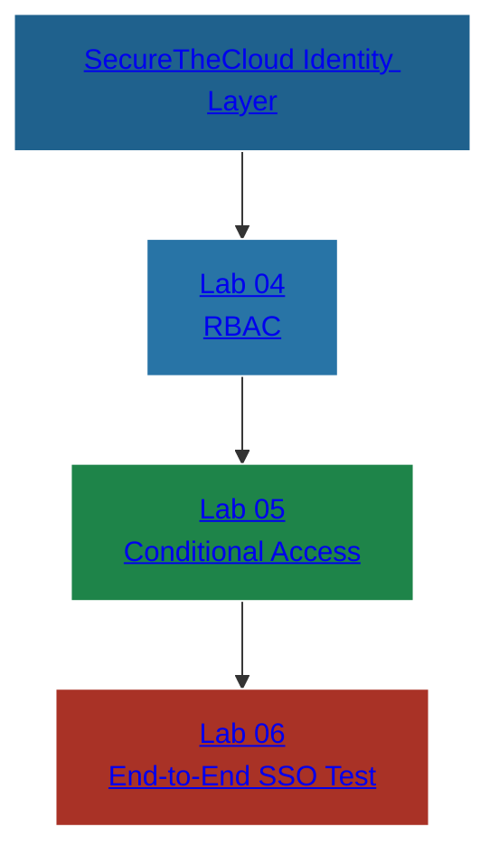

📘 LAB 06 — End-to-End SSO Login Test (Entra → AWS)
SecureTheCloud Identity Federation Academy — Volume 1
<div align="center">

</div>

🔗 Interactive Identity Architecture Map (Clickable)

(Matching Labs 01–05 formatting & colors)


---
#️⃣ Lab 06 — End-to-End SSO Login Test
Validate the full federation pipeline: Entra → Conditional Access → AWS SSO → Permission Sets → Console Access

🎯 Objective

This is the final validation lab.
You will confirm that:

Authentication is handled by Microsoft Entra ID

Conditional Access (Lab 05) is applied

SCIM identities (Lab 03) appear in AWS IAM Identity Center

Permission sets (Lab 04) are assigned correctly

The user successfully logs into AWS Console via SSO

Access levels match Zero Trust RBAC

All sign-in logs are correctly generated in Entra + AWS

This ensures a fully functional, production-ready federation.

🧩 Prerequisites
✔ Labs 01–05 completed
✔ Entra enterprise app configured
✔ SCIM provisioning active and synced
✔ Permission sets assigned
✔ Compatible Conditional Access policy enabled
✔ Entra test user provisioned
✔ AWS reserved SSO roles created

#️⃣ Step 1 — Ensure the User is Assigned

In Entra → Enterprise App:

AWS IAM Identity Center (SecureTheCloud)


Check:

Users and Groups → Test user → Assigned? ✔


In AWS Console:

IAM Identity Center → Users


Check:

User synced? ✔
Group synced? ✔

---

#️⃣ Step 2 — Confirm Permission Set Assignment

In AWS:

IAM Identity Center → AWS Accounts → <Management or Member Account>


Validate:

Group assigned

Permission Set applied

Role created (AWSReservedSSO_xxx)

If missing:

SCIM troubleshooting

Group assignment issue

---
#️⃣ Step 3 — Begin SSO Login Flow

In a private/incognito browser:

Go to your AWS SSO user portal:

https://<your-domain>.awsapps.com/start


Enter your Entra user email.

You should be redirected to:

🔐 login.microsoftonline.com

---
#️⃣ Step 4 — Conditional Access Trigger

Based on your policy (Lab 05), Entra should enforce:

MFA prompt

Device compliance

Location requirement

Risk evaluation

Session controls

Look for:

✔ Authenticator prompt  
✔ SMS/Push/TOTP  
✔ “Sign in frequency enforced” message  


If CA fails to hit:

Wrong app selected in CA

CA still in report-only

CA conditions not matching

---
#️⃣ Step 5 — AWS SSO Portal Landing Page

After authentication:

You should land at:

AWS IAM Identity Center Portal


Showing accounts and roles assigned to the user.

Example:

AWS Account 764265373335
• SecureTheCloud-Developer (PowerUserAccess)
• SecureTheCloud-Auditor (SecurityAudit)

Expectations:

Only roles mapped to user’s group should appear

No extra roles should appear

Least privilege enforced

---
#️⃣ Step 6 — Launch AWS Console

Click:

Management Console


Check:

✔ The correct AWS account opens
✔ The correct role is assumed
✔ AWS top right corner shows:
AWSReservedSSO_<PermissionSetName>_<RandomString>

Validate access:

For Developer role:

IAM: Access denied

EC2: Allowed

S3: Allowed (read/write depending on policy)

For Auditor role:

IAM: Read-only

S3: Read-only

CloudTrail: Read-only

For Admin role:

Everything allowed

---
#️⃣ Step 7 — Check AWS CloudTrail Logs

Go to:

CloudTrail → Event History


Filter:

Username: AWSReservedSSO_*


You should see:

AssumeRoleWithSAML events

Access events based on Permission Set

MFA context passed through

---
#️⃣ Step 8 — Check Entra Sign-in Logs

In Entra:

Identity → Monitoring → Sign-in logs


Filter by:

Application → AWS IAM Identity Center


You should see:

Correct user

CA policy requirement status

Device info

MFA details

SAML redirect to AWS

---
#️⃣ Step 9 — Check Provisioning Logs (Bonus)

In Entra:

Enterprise Application → Provisioning → Logs


Validate:

Latest provisioning cycle

Success messages

Group membership provisioning

---
🧪 Lab Completion Checklist
```
Requirement	Status
User assigned to Entra Enterprise App	✔
User synced to AWS (SCIM)	✔
Permission Set assigned	✔
SSO login successful	✔
Conditional Access enforced	✔
AWS console role assumption successful	✔
CloudTrail logs verified	✔
Entra sign-in logs verified	✔

🎉 Your Identity Federation between Entra ↔ AWS is fully operational.

------
🔗 Next Steps
➜ Continue to Volume 2 — GCP Workforce Identity Federation

<div align="center">

© 2025 SecureTheCloud.dev — All Rights Reserved
Zero Trust • Multi-Cloud • Enterprise Architecture

</div>
