# 🧩 SecureTheCloud Academy — Volume 1  
## **Chapter 01 — Identity Foundations**  
Zero Trust Identity Layer

---

📺 **Watch the Identity Foundations Lesson:**  
https://www.youtube.com/@SecureTheCloud-dev

---

```mermaid
flowchart TD

%% =============================
%% SECURETHECLOUD COLOR SYSTEM
%% =============================
classDef blue fill:#1F618D,stroke:#ffffff,color:white,font-weight:bold;
classDef gold fill:#F4B400,stroke:#ffffff,color:black;
classDef teal fill:#1ABC9C,stroke:#ffffff,color:black;
classDef grey fill:#BDC3C7,stroke:#2C3E50,color:black;
classDef orange fill:#E67E22,stroke:#ffffff,color:white;
classDef slate fill:#2C3E50,stroke:#ffffff,color:white;

%% =============================
%% ROOT NODE
%% =============================
A["<a href='../README.md'>Identity Foundations</a>"]:::blue

%% =============================
%% MAIN IDENTITY SECTIONS
%% =============================
A --> B1["<a href='01-identity-foundations.md#authentication-vs-authorization'>AuthN vs AuthZ</a>"]:::gold
A --> B2["<a href='01-identity-foundations.md#identity-planes'>Identity Planes</a>"]:::teal
A --> B3["<a href='01-identity-foundations.md#identity-lifecycle'>Identity Lifecycle</a>"]:::orange
A --> B4["<a href='01-identity-foundations.md#cloud-identity-models'>Cloud Identity Models</a>"]:::slate
A --> B5["<a href='04-federation-theory.md'>Federation Primer</a>"]:::gold
A --> B6["<a href='05-identity-governance.md'>Zero Trust Identity</a>"]:::blue
A --> B7["<a href='../labs/01-aws-identity-center.md'>Hands-On Identity Lab</a>"]:::teal

%% =============================
%% AUTHN VS AUTHZ
%% =============================
B1 --> C1["<a href='https://datatracker.ietf.org/doc/html/rfc6749'>OAuth 2.0 (RFC 6749)</a>"]:::grey
B1 --> C2["<a href='https://datatracker.ietf.org/doc/html/rfc7519'>JWT (RFC 7519)</a>"]:::grey
B1 --> C3["<a href='https://docs.aws.amazon.com/IAM/latest/UserGuide/introduction_access-management.html'>AWS IAM Access Management</a>"]:::grey

%% =============================
%% IDENTITY PLANES
%% =============================
B2 --> D1["<a href='https://learn.microsoft.com/entra'>Entra ID — Identity Plane</a>"]:::teal
B2 --> D2["<a href='02-aws-identity-center-overview.md'>AWS IAM Identity Center — Access Plane</a>"]:::teal
B2 --> D3["<a href='../README.md#volume-3-azure-zero-trust'>Volume 3 — Azure Zero Trust (Future)</a>"]:::gold
B2 --> D4["<a href='../README.md#volume-4-multi-cloud-siem'>Volume 4 — SIEM Integration</a>"]:::gold

%% =============================
%% IDENTITY LIFECYCLE
%% =============================
B3 --> E1["<a href='https://datatracker.ietf.org/doc/html/rfc7643'>SCIM Core Schema (RFC 7643)</a>"]:::orange
B3 --> E2["<a href='/labs/03-scim-provisioning.md'>Lifecycle Automation (SCIM Lab)</a>"]:::orange
B3 --> E3["<a href='https://learn.microsoft.com/entra/identity/governance'>Access Reviews & Governance</a>"]:::orange

%% =============================
%% CLOUD IDENTITY MODELS
%% =============================
B4 --> F1["<a href='https://docs.aws.amazon.com/IAM/latest/UserGuide/id_roles.html'>AWS IAM Roles</a>"]:::slate
B4 --> F2["<a href='https://learn.microsoft.com/entra/identity/enterprise-apps'>Azure Enterprise Apps</a>"]:::slate
B4 --> F3["<a href='https://cloud.google.com/iam/docs/service-accounts'>GCP Service Accounts</a>"]:::slate

%% =============================
%% FEDERATION
%% =============================
B5 --> G1["<a href='04-federation-theory.md#saml'>SAML 2.0</a>"]:::gold
B5 --> G2["<a href='04-federation-theory.md#oidc'>OIDC</a>"]:::gold
B5 --> G3["<a href='04-federation-theory.md#scim'>SCIM</a>"]:::gold

%% =============================
%% ZERO TRUST IDENTITY
%% =============================
B6 --> H1["<a href='05-identity-governance.md#conditional-access'>Conditional Access</a>"]:::blue
B6 --> H2["<a href='05-identity-governance.md#risk-based-access'>Risk-Based Access</a>"]:::blue
B6 --> H3["<a href='05-identity-governance.md#identity-governance'>Identity Governance</a>"]:::blue

%% =============================
%% LABS
%% =============================
B7 --> I1["<a href='../labs/01-aws-identity-center.md'>Lab 01 — AWS IAM Identity Center</a>"]:::teal
B7 --> I2["<a href='../labs/02-entra-enterprise-app.md'>Lab 02 — Entra Enterprise App</a>"]:::teal
```

# 🌍 Overview  
Identity is the core control plane of all Zero Trust architectures.  
Before traffic is allowed, before permissions are granted, before data is accessed — **identity must be verified, authenticated, and authorized.**

In SecureTheCloud Volume 1, we unify:

- **Microsoft Entra ID (Azure AD)** → as the Enterprise Identity Provider (IdP)  
- **AWS IAM Identity Center** → as the Cloud Service Provider (SP)

This chapter explains the fundamentals that will support the federation, SCIM provisioning, RBAC design, and Zero Trust policies that follow.

---

# 🔐 What Is Identity in the Cloud?

Identity is no longer usernames and passwords.  
Identity is now:

- A **security perimeter**  
- A **source of truth**  
- A **policy evaluation engine**  
- A **risk evaluation mechanism**  
- A **Zero Trust enforcement point**

Identity includes:

### ✔ Users  
### ✔ Groups  
### ✔ Devices  
### ✔ Workloads  
### ✔ Service principals  
### ✔ Tokens  
### ✔ Claims  
### ✔ Session evaluation  

---

# 🧠 **Modern Identity Is Token-Based**

In Zero Trust identity platforms, authentication produces:

### ⭐ Tokens (not passwords)

Types include:

- **ID Token** (Who you are)  
- **Access Token** (What you can access)  
- **Refresh Token** (Extend your session)  

Tokens contain:

- **Claims**  
- **Issuer**  
- **Audience**  
- **Groups**  
- **Permissions**  
- **Conditional Access results**  

Identity = *the brain of your cloud architecture.*

---

# 🏛️ **Identity Provider (IdP)**  
An Identity Provider is responsible for:

- User authentication  
- MFA  
- Risk scoring  
- Token issuance  
- Conditional Access  
- Session lifetime  
- Policy enforcement  

For SecureTheCloud:

### **Microsoft Entra ID = The IdP**

Everything flows from Entra:

- Federation  
- SCIM  
- Conditional Access  
- Zero Trust rules  
- Graph-based provisioning  

---

# 🏢 **Service Provider (SP)**

A Service Provider consumes tokens issued by the IdP.

For SecureTheCloud:

### **AWS IAM Identity Center = The SP**

AWS relies on Entra for:

- Authentication  
- MFA  
- User identities  
- Groups  
- Provisioning  
- Permission Set mapping  

---

# 🔄 Identity Flow (High-Level)

1. User attempts to access AWS  
2. AWS redirects to Microsoft Entra SSO  
3. Entra performs MFA + policy evaluation  
4. Token is issued to AWS  
5. AWS maps identity to **Permission Sets**  
6. User receives *temporary, least-privilege credentials*  

This is the **modern Zero Trust identity handshake.**

---

# 🔁 Federation + Provisioning + Authorization

Identity integration consists of 3 layers:

### **1. Federation (Authentication)**  
OIDC / SAML → trusting authentication from Entra.

### **2. Provisioning (Identity Sync)**  
SCIM → syncing users & groups from Entra to AWS.

### **3. Authorization (Permissions)**  
Permission Sets → mapping identities to roles & access.

This course teaches all 3 with hands-on labs.

---

# 🚀 What’s Next?

Continue to:

➡️ **Chapter 02 — AWS IAM Identity Center Overview**  
[Next → 02-aws-identity-center-overview.md](02-aws-identity-center-overview.md)

---

# 🔙 Back to README  
https://github.com/S3curethecloud/multi-cloud-identity-aws-entra

---

# 🧭 **SecureTheCloud Footer**

**© 2025 SecureTheCloud.dev — All Rights Reserved**  
Zero Trust • Multi-Cloud • Enterprise Architecture  

[Terms](https://securethecloud.dev/terms) •  
[Privacy](https://securethecloud.dev/privacy) •  
[Status](https://securethecloud.dev/status) •  
[Community](https://t.me/SecureTheCloud) •  
[Docs](https://securethecloud.dev/docs)

