# 🧩 SecureTheCloud Academy — Volume 1  
## **Chapter 02 — AWS IAM Identity Center Overview**

---

📺 **Watch the AWS Identity Center Lesson:**  
https://www.youtube.com/@SecureTheCloud-dev

---

```mermaid
flowchart TD

%% =============================
%% SECURETHECLOUD COLOR SYSTEM
%% =============================
classDef blue fill:#1F618D,stroke:#ffffff,color:white,font-weight:bold;
classDef gold fill:#F4B400,stroke:#ffffff,color:black;
classDef teal fill:#1ABC9C,stroke:#ffffff,color:black;
classDef grey fill:#BDC3C7,stroke:#2C3E50,color:black;
classDef orange fill:#E67E22,stroke:#ffffff,color:white;
classDef slate fill:#2C3E50,stroke:#ffffff,color:white;

%% =============================
%% ROOT NODE
%% =============================
A["<a href='../theory/02-aws-identity-center-overview.md'>AWS IAM Identity Center<br/>(Formerly AWS SSO)</a>"]:::blue

%% =============================
%% PRIMARY SECTIONS
%% =============================
A --> B1["<a href='../theory/02-aws-identity-center-overview.md#identity-source'>Identity Source</a>"]:::gold
A --> B2["<a href='../theory/02-aws-identity-center-overview.md#users-and-groups'>Users & Groups</a>"]:::teal
A --> B3["<a href='../theory/06-permission-sets-rbac.md'>Permission Sets</a>"]:::orange
A --> B4["<a href='../theory/02-aws-identity-center-overview.md#aws-accounts'>AWS Accounts</a>"]:::slate
A --> B5["<a href='../theory/02-aws-identity-center-overview.md#applications'>Applications</a>"]:::grey
A --> B6["<a href='../theory/04-federation-theory.md#authentication-flow'>Authentication Flow</a>"]:::blue

%% =============================
%% IDENTITY SOURCE (CLICKABLE)
%% =============================
B1 --> C1["<a href='../theory/04-federation-theory.md#entra-id-external-idp'>Entra ID (External IdP)</a>"]:::gold
B1 --> C2["<a href='../theory/02-aws-identity-center-overview.md#identity-center-directory'>AWS Identity Center Directory</a>"]:::gold
B1 --> C3["<a href='../labs/03-scim-provisioning.md'>SCIM Provisioning Setup</a>"]:::gold
B1 --> C4["<a href='../labs/02-entra-enterprise-app.md'>SAML / OIDC Federation</a>"]:::gold

%% =============================
%% USERS & GROUPS (CLICKABLE)
%% =============================
B2 --> D1["<a href='../labs/03-scim-provisioning.md'>Provisioned Users (SCIM)</a>"]:::teal
B2 --> D2["<a href='../labs/03-scim-provisioning.md#group-sync'>Provisioned Groups</a>"]:::teal
B2 --> D3["<a href='../theory/06-permission-sets-rbac.md#group-role-mapping'>Group → Role Mapping</a>"]:::teal

%% =============================
%% PERMISSION SETS (CLICKABLE)
%% =============================
B3 --> E1["<a href='../theory/06-permission-sets-rbac.md#aws-managed-policies'>AWS Managed Policies</a>"]:::orange
B3 --> E2["<a href='../theory/06-permission-sets-rbac.md#custom-json-policies'>Custom JSON Policies</a>"]:::orange
B3 --> E3["<a href='../theory/06-permission-sets-rbac.md#session-duration'>Session Duration</a>"]:::orange
B3 --> E4["<a href='../theory/06-permission-sets-rbac.md#inline-permissions'>Inline Permissions</a>"]:::orange
B3 --> E5["<a href='../theory/06-permission-sets-rbac.md#enterprise-rbac'>Enterprise RBAC</a>"]:::orange

%% =============================
%% AWS ACCOUNTS (CLICKABLE)
%% =============================
B4 --> F1["<a href='../theory/02-aws-identity-center-overview.md#organizational-units'>Organizational Units</a>"]:::slate
B4 --> F2["<a href='../labs/01-aws-identity-center.md#account-assignments'>Account Assignments</a>"]:::slate
B4 --> F3["<a href='../theory/06-permission-sets-rbac.md#least-privilege'>Least Privilege Boundaries</a>"]:::slate

%% =============================
%% APPLICATIONS (CLICKABLE)
%% =============================
B5 --> G1["<a href='../labs/01-aws-identity-center.md#console-access'>AWS Console Access</a>"]:::grey
B5 --> G2["<a href='../theory/02-aws-identity-center-overview.md#aws-cli-sso'>AWS CLI (SSO)</a>"]:::grey
B5 --> G3["<a href='../theory/02-aws-identity-center-overview.md#sdk-integration'>AWS SDK Integration</a>"]:::grey
B5 --> G4["<a href='../labs/02-entra-enterprise-app.md#saml-applications'>SAML Applications</a>"]:::grey

%% =============================
%% AUTHENTICATION FLOW (CLICKABLE)
%% =============================
B6 --> H1["<a href='../theory/04-federation-theory.md#user-authentication'>User Initiates Access</a>"]:::blue
H1 --> H2["<a href='../theory/04-federation-theory.md#entra-redirect'>Redirect to Entra ID</a>"]:::blue
H2 --> H3["<a href='../theory/05-identity-governance.md#conditional-access'>MFA + Conditional Access</a>"]:::blue
H3 --> H4["<a href='../theory/04-federation-theory.md#token-issuance'>Token Issuance</a>"]:::blue
H4 --> H5["<a href='../theory/06-permission-sets-rbac.md#permission-set-selection'>Permission Set Mapping</a>"]:::blue
H5 --> H6["<a href='../labs/01-aws-identity-center.md#cli-and-console'>Console / CLI Access</a>"]:::blue
H6 --> H7["<a href='../theory/05-identity-governance.md#zero-trust'>Zero Trust Enforcement</a>"]:::blue
```

# 🌍 Overview

AWS IAM Identity Center (formerly AWS SSO) is the **central identity authority** for accessing AWS:

- AWS Console  
- AWS CLI  
- AWS SDK  
- AWS MFA sessions  
- AWS permission boundaries  

When integrated with Microsoft Entra ID, Identity Center becomes a **federated SP** (Service Provider) receiving tokens from Entra ID.

---

# 🔐 What Identity Center Controls

### ✔ Who can log in  
### ✔ Which AWS accounts they can access  
### ✔ What roles they receive  
### ✔ How temporary permissions are granted  
### ✔ How sessions are established  
### ✔ MFA enforcement (when not delegated to IdP)  

Identity Center = the authorization brain inside AWS.

---

# 🧩 Identity Center Constructs

### **1. Users & Groups**
- **Not local** if SCIM is enabled  
- Managed in Entra ID  
- Provisioned automatically to AWS  

### **2. Permission Sets**
Define:
- Allowed actions  
- Session duration  
- Policy boundaries  
- AWS managed or custom policies  

### **3. Assignments**
Glue between:
- User/Group  
- AWS Account  
- Permission Set  

### **4. Identity Source**
For federation:
- External Identity Provider = **Microsoft Entra ID**

---

# 🧠 How Identity Center Works with Entra ID

1. User signs into AWS → redirected to Entra ID  
2. Entra ID authenticates user  
3. MFA + Conditional Access applied  
4. Entra issues SAML/OIDC tokens  
5. AWS establishes session  
6. Permission Sets applied  
7. User receives **temporary**, **least-privilege**, **rotating credentials**  

This eliminates IAM Users forever.

---

# 🔒 Why Identity Center Matters in Zero Trust

### ✔ No long-term access keys  
### ✔ No IAM passwords  
### ✔ No static roles  
### ✔ No manual user management  
### ✔ No privilege drift  
### ✔ Policy evaluation done OUTSIDE AWS  

Identity Center + Entra ID = Zero Trust foundation.

---

# 🚀 Next Chapter  
➡️ **Chapter 03 — Microsoft Entra ID Overview**  
[Next → 03-entra-id-overview.md](03-entra-id-overview.md)

⬅️ **Back to Chapter 01**  
[01-identity-foundations.md](01-identity-foundations.md)

---

# 🧭 SecureTheCloud Footer  
*(Same footer as Chapter 01 — omitted here for brevity, but paste it)*  
