# 🧩 SecureTheCloud Academy — Volume 1  
## **Chapter 03 — Microsoft Entra ID Overview**

📺 **Watch the Entra ID Lesson:**  
https://www.youtube.com/@SecureTheCloud-dev

---

```mermaid
flowchart TD

%% =============================
%% SECURETHECLOUD COLOR SYSTEM
%% =============================
classDef blue fill:#1F618D,stroke:#ffffff,color:white,font-weight:bold;
classDef gold fill:#F4B400,stroke:#ffffff,color:black;
classDef teal fill:#1ABC9C,stroke:#ffffff,color:black;
classDef grey fill:#BDC3C7,stroke:#2C3E50,color:black;
classDef orange fill:#E67E22,stroke:#ffffff,color:white;
classDef slate fill:#2C3E50,stroke:#ffffff,color:white;

%% =============================
%% ROOT NODE
%% =============================
A["<a href='../theory/03-azure-entra-overview.md'>Microsoft Entra ID<br/>(Azure AD)</a>"]:::blue

%% =============================
%% PRIMARY SECTIONS
%% =============================
A --> B1["<a href='../theory/03-azure-entra-overview.md#identity-objects'>Identity Objects</a>"]:::gold
A --> B2["<a href='../theory/03-azure-entra-overview.md#enterprise-applications'>Enterprise Applications</a>"]:::teal
A --> B3["<a href='../theory/03-azure-entra-overview.md#app-registrations'>App Registrations</a>"]:::orange
A --> B4["<a href='../theory/03-azure-entra-overview.md#conditional-access'>Conditional Access</a>"]:::slate
A --> B5["<a href='../theory/03-azure-entra-overview.md#roles-rbac'>Roles & RBAC</a>"]:::grey
A --> B6["<a href='../theory/04-federation-theory.md'>Federation & Tokens</a>"]:::blue

%% =============================
%% IDENTITY OBJECTS
%% =============================
B1 --> C1["<a href='../theory/03-azure-entra-overview.md#users'>Users</a>"]:::gold
B1 --> C2["<a href='../theory/03-azure-entra-overview.md#groups'>Groups</a>"]:::gold
B1 --> C3["<a href='../theory/03-azure-entra-overview.md#service-principals'>Service Principals</a>"]:::gold
B1 --> C4["<a href='../theory/03-azure-entra-overview.md#managed-identities'>Managed Identities</a>"]:::gold

%% =============================
%% ENTERPRISE APPLICATIONS
%% =============================
B2 --> D1["<a href='../labs/02-entra-enterprise-app.md'>SAML/SSO Enterprise App</a>"]:::teal
B2 --> D2["<a href='../labs/02-entra-enterprise-app.md'>AWS Federation App</a>"]:::teal
B2 --> D3["<a href='../theory/04-federation-theory.md#saml'>SAML Integration</a>"]:::teal
B2 --> D4["<a href='../theory/04-federation-theory.md#scim'>SCIM Provisioning Setup</a>"]:::teal

%% =============================
%% APP REGISTRATIONS
%% =============================
B3 --> E1["<a href='../theory/04-federation-theory.md#oidc'>OIDC Apps</a>"]:::orange
B3 --> E2["<a href='../theory/03-azure-entra-overview.md#client-secrets'>Client Secrets</a>"]:::orange
B3 --> E3["<a href='../theory/03-azure-entra-overview.md#certificates'>Certificates</a>"]:::orange
B3 --> E4["<a href='../theory/03-azure-entra-overview.md#permissions'>API Permissions</a>"]:::orange

%% =============================
%% CONDITIONAL ACCESS
%% =============================
B4 --> F1["<a href='../theory/05-identity-governance.md#conditional-access'>Risk Policies</a>"]:::slate
B4 --> F2["<a href='../theory/05-identity-governance.md#session-policies'>Session Controls</a>"]:::slate
B4 --> F3["<a href='../theory/05-identity-governance.md#device-compliance'>Device Compliance</a>"]:::slate
B4 --> F4["<a href='../theory/05-identity-governance.md#mfa-enforcement'>MFA Enforcement</a>"]:::slate

%% =============================
%% AZURE RBAC
%% =============================
B5 --> G1["<a href='../theory/03-azure-entra-overview.md#directory-roles'>Directory Roles</a>"]:::grey
B5 --> G2["<a href='../theory/03-azure-entra-overview.md#role-assignments'>Role Assignments</a>"]:::grey
B5 --> G3["<a href='../theory/03-azure-entra-overview.md#pim'>Privileged Identity Management (PIM)</a>"]:::grey

%% =============================
%% FEDERATION & TOKENS
%% =============================
B6 --> H1["<a href='../theory/04-federation-theory.md#saml'>SAML Tokens</a>"]:::blue
B6 --> H2["<a href='../theory/04-federation-theory.md#oidc'>OIDC Tokens</a>"]:::blue
B6 --> H3["<a href='../theory/04-federation-theory.md#scim'>SCIM Automation</a>"]:::blue
B6 --> H4["<a href='../labs/02-entra-enterprise-app.md'>Azure → AWS Federation Lab</a>"]:::blue

%% ROOT STYLE
A:::blue
```

# 🌍 Overview

Microsoft Entra ID (Azure AD) is the **identity backbone** for:

- Users  
- Groups  
- MFA  
- Conditional Access  
- Token issuance  
- Risk scoring  
- Identity governance  
- SCIM provisioning  
- Application SSO  

Entra ID is the **IdP** (Identity Provider) for our AWS federation.

---

# 🔐 Entra ID Capabilities

### ✔ MFA  
### ✔ Conditional Access  
### ✔ Identity Governance  
### ✔ Risk-based Sign-in Policies  
### ✔ Device Compliance  
### ✔ SAML / OIDC Support  
### ✔ SCIM 2.0 Provisioning  
### ✔ App Registrations  
### ✔ Enterprise Apps  

You control everything centrally.

---

# 🔄 Token Issuance

Entra issues:

- ID Token  
- Access Token  
- Refresh Token  
- SAML Assertions  

Used by AWS to establish secure federated sessions.

---

# 🛡️ Zero Trust in Entra

Zero Trust principles enforced:

- Verify explicitly  
- Use least privilege  
- Assume breach  

Conditional Access is where Zero Trust lives.

---

# 🚀 Next Chapter  
➡️ **Chapter 04 — Federation Theory (SAML, OIDC, SCIM)**  
[04-federation-theory.md](04-federation-theory.md)

⬅️ Back to Chapter 02  
[02-aws-identity-center-overview.md](02-aws-identity-center-overview.md)
