# 📘 CHAPTER 04 — Federation Theory (SAML • OIDC • SCIM)
### *SecureTheCloud Identity Academy — Volume 1*

---

```mermaid
flowchart TD
%% =============================
%% SECURETHECLOUD COLOR SYSTEM
%% =============================
classDef blue fill:#1F618D,stroke:#ffffff,color:white,font-weight:bold;
classDef gold fill:#F4B400,stroke:#ffffff,color:black;
classDef teal fill:#1ABC9C,stroke:#ffffff,color:black;
classDef grey fill:#BDC3C7,stroke:#2C3E50,color:black;
classDef orange fill:#E67E22,stroke:#ffffff,color:white;
classDef slate fill:#2C3E50,stroke:#ffffff,color:white;

%% =============================
%% ROOT NODE
%% =============================
A["<a href='../theory/04-federation-theory.md'>Federation Theory<br/>(SAML • OIDC • SCIM)</a>"]:::blue

%% =============================
%% PRIMARY SECTIONS
%% =============================
A --> B1["<a href='../theory/04-federation-theory.md#saml'>SAML 2.0</a>"]:::gold
A --> B2["<a href='../theory/04-federation-theory.md#oidc'>OIDC / OAuth 2.0</a>"]:::teal
A --> B3["<a href='../theory/04-federation-theory.md#scim'>SCIM Identity Lifecycle</a>"]:::orange
A --> B4["<a href='../theory/04-federation-theory.md#federation-flow'>Federation Flow</a>"]:::slate
A --> B5["<a href='../labs/02-entra-enterprise-app.md'>Entra → AWS Federation Lab</a>"]:::grey
A --> B6["<a href='../labs/03-scim-provisioning.md'>SCIM Provisioning Lab</a>"]:::teal

%% =============================
%% SAML SECTION
%% =============================
B1 --> C1["<a href='https://docs.oasis-open.org/security/saml/v2.0/saml-core-2.0-os.pdf'>SAML Assertions</a>"]:::gold
B1 --> C2["<a href='../theory/04-federation-theory.md#acs-url'>AWS ACS URL</a>"]:::gold
B1 --> C3["<a href='../theory/04-federation-theory.md#idp-metadata'>IdP Metadata XML</a>"]:::gold
B1 --> C4["<a href='../theory/04-federation-theory.md#sp-metadata'>SP Metadata XML</a>"]:::gold

%% =============================
%% OIDC SECTION
%% =============================
B2 --> D1["<a href='https://datatracker.ietf.org/doc/html/rfc6749'>OAuth 2.0 (RFC 6749)</a>"]:::teal
B2 --> D2["<a href='https://datatracker.ietf.org/doc/html/rfc7519'>JWT (RFC 7519)</a>"]:::teal
B2 --> D3["<a href='../theory/03-azure-entra-overview.md#oidc-apps'>OIDC App Registrations</a>"]:::teal
B2 --> D4["<a href='../theory/04-federation-theory.md#id-tokens'>ID Tokens</a>"]:::teal

%% =============================
%% SCIM SECTION
%% =============================
B3 --> E1["<a href='https://datatracker.ietf.org/doc/html/rfc7643'>SCIM Core Schema (RFC 7643)</a>"]:::orange
B3 --> E2["<a href='https://datatracker.ietf.org/doc/html/rfc7644'>SCIM API Spec (RFC 7644)</a>"]:::orange
B3 --> E3["<a href='../labs/03-scim-provisioning.md#group-sync'>Group Provisioning</a>"]:::orange
B3 --> E4["<a href='../labs/03-scim-provisioning.md#user-sync'>User Provisioning</a>"]:::orange

%% =============================
%% FEDERATION FLOW (CLICKABLE)
%% =============================
B4 --> F1["<a href='../theory/04-federation-theory.md#user-authenticates'>1. User Authenticates</a>"]:::slate
B4 --> F2["<a href='../theory/05-identity-governance.md#conditional-access'>2. Conditional Access Policies</a>"]:::slate
B4 --> F3["<a href='../theory/04-federation-theory.md#token-issued'>3. Token Issued (SAML/OIDC)</a>"]:::slate
B4 --> F4["<a href='../theory/06-permission-sets-rbac.md#permission-set-mapping'>4. Role Mapping via Permission Sets</a>"]:::slate
B4 --> F5["<a href='../labs/01-aws-identity-center.md#aws-console-access'>5. Session Access Granted</a>"]:::slate

%% =============================
%% LABS
%% =============================
B5 --> G1["<a href='../labs/02-entra-enterprise-app.md#configure-sso'>Configure SSO</a>"]:::grey
B5 --> G2["<a href='../labs/02-entra-enterprise-app.md#metadata-exchange'>Metadata Exchange</a>"]:::grey
B5 --> G3["<a href='../labs/02-entra-enterprise-app.md#saml-test'>Test SAML Login</a>"]:::grey

B6 --> H1["<a href='../labs/03-scim-provisioning.md#provision-users'>Provision Users</a>"]:::teal
B6 --> H2["<a href='../labs/03-scim-provisioning.md#provision-groups'>Provision Groups</a>"]:::teal
```

# 🎯 Chapter Objective  
This chapter explains the three core protocols that make multi-cloud identity possible:

- **SAML** — Used for authentication (AuthN) between Entra ID and AWS  
- **OIDC** — Modern protocol for tokens and applications  
- **SCIM** — Automated user & group provisioning (identity lifecycle)

You will learn:

- How federation works  
- How AWS trusts Entra  
- Why tokens replace passwords  
- Why Identity Source = Entra ID  
- How AWS maps users → permission sets  
- How SCIM automates the workforce lifecycle  

---

# 🧩 **1. What is Federation?**

Federation means:

> **Using an external identity provider (IdP) to authenticate and authorize users into a service provider (SP).**

In Volume 1:

- **Microsoft Entra ID = IdP**  
- **AWS IAM Identity Center = SP**

This allows:

- ✔ SSO  
- ✔ Centralized identity  
- ✔ Unified governance  
- ✔ Zero passwords inside AWS  

Azure handles the identity.  
AWS handles the access.

---

# 🟦 **2. SAML — Security Assertion Markup Language**

SAML is an XML-based protocol used for:

- Authentication  
- Identity claims  
- SSO between IdP ↔ SP  

### AWS uses SAML for:
- Signing users into AWS console  
- Passing identity claims  
- Establishing trust between Entra ↔ IAM Identity Center  

### SAML Flow (Simplified)
---

User → Entra ID → SAML assertion → AWS → Role → Session

- **IdP** → Entra ID  
- **SP** → AWS IAM Identity Center  
- **Assertion** → Proof of identity  
- **Metadata** → XML configuration for trust  

This is old but **very stable** for enterprise federation.

---

# 🟦 **3. OIDC — OpenID Connect**

OIDC is the modern authentication protocol built on OAuth 2.0.

OIDC uses **JSON Web Tokens (JWT)** instead of XML.

### Uses:
- App authentication  
- API identity  
- Device login  
- SaaS apps  

### Why not used for AWS federation here?

AWS IAM Identity Center still requires **SAML** for workforce SSO.

OIDC is used for:

- Workload identity  
- Application identity  
- OAuth flows  
- External identity providers  

Later in Volume 3:
- Azure Conditional Access uses OIDC  
- Entra ID tokens → AWS sessions  

---

# 🟧 **4. SCIM — System for Cross-domain Identity Management**

SCIM handles:

### ✔ Automated user provisioning  
### ✔ Automated group provisioning  
### ✔ Attribute sync  
### ✔ Lifecycle management  

This is critical for Zero Trust identity lifecycle.

### SCIM Flow

**Entra ID → SCIM API → AWS IAM Identity Center**

AWS creates:

- Users  
- Groups  
- Group membership  

Automatically.

No manual IAM Users ever again.

---

# 🧠 **5. How Identity Federation Works in AWS**

### Step 1 — Entra ID authenticates user  
MFA, Conditional Access, risk evaluation.

### Step 2 — SAML token sent to AWS  
Contains user identity + attributes.

### Step 3 — AWS IAM Identity Center maps user → Permission Sets  
Authorization happens here.

### Step 4 — SCIM maintains user + group lifecycle  
Admins never manually create IAM users.

---

# 🛡️ **6. Zero Trust Integration**

Federation enforces:

- Verified identity  
- MFA  
- Conditional Access policies  
- Session risk evaluation  
- Device compliance  
- Enforced least privilege  
- Automated offboarding  

Together:

> Federation + SCIM + Conditional Access = Zero Trust Identity Core

---

# 📚 Summary

| Protocol | Purpose | Used in Volume 1 |
|---------|---------|------------------|
| **SAML** | Federation AuthN | Yes (AWS SSO login) |
| **OIDC** | Token-based AuthN | Yes (later in CA) |
| **SCIM** | User/Group Provisioning | Yes (Lab 03) |

---

# ⬅️ Next Chapter  
👉 **Chapter 05 — Identity Governance & Conditional Access**
