# 📘 CHAPTER 05 — Identity Governance & Conditional Access  
### *SecureTheCloud Identity Academy — Volume 1*

---

# 🎯 Chapter Objective  
This chapter teaches:

- What Identity Governance is  
- Why Conditional Access is the backbone of Zero Trust  
- How governance affects AWS SSO  
- How Entra policies apply to federated identities  
- The real-world patterns used in enterprise cloud security  

---

```mermaid
flowchart TD

%% =============================
%% SECURETHECLOUD COLOR SYSTEM
%% =============================
classDef blue fill:#1F618D,stroke:#ffffff,color:white,font-weight:bold;
classDef gold fill:#F4B400,stroke:#ffffff,color:black;
classDef teal fill:#1ABC9C,stroke:#ffffff,color:black;
classDef grey fill:#BDC3C7,stroke:#2C3E50,color:black;
classDef orange fill:#E67E22,stroke:#ffffff,color:white;
classDef slate fill:#2C3E50,stroke:#ffffff,color:white;

%% =============================
%% ROOT NODE
%% =============================
A["<a href='../theory/05-identity-governance.md'>Zero Trust Identity<br/>& Identity Governance</a>"]:::blue

%% =============================
%% MAIN SECTIONS
%% =============================
A --> B1["<a href='../theory/05-identity-governance.md#zero-trust-principles'>Zero Trust Principles</a>"]:::gold
A --> B2["<a href='../theory/05-identity-governance.md#conditional-access'>Conditional Access</a>"]:::teal
A --> B3["<a href='../theory/05-identity-governance.md#identity-governance'>Identity Governance</a>"]:::orange
A --> B4["<a href='../theory/05-identity-governance.md#session-controls'>Session Controls</a>"]:::slate
A --> B5["<a href='../theory/04-federation-theory.md'>Federation & Tokens</a>"]:::grey
A --> B6["<a href='../labs/01-aws-identity-center.md'>Hands-On Zero Trust Lab</a>"]:::teal

%% =============================
%% ZERO TRUST PRINCIPLES
%% =============================
B1 --> C1["<a href='../theory/05-identity-governance.md#verify-explicitly'>Verify Explicitly</a>"]:::gold
B1 --> C2["<a href='../theory/05-identity-governance.md#least-privilege'>Least Privilege Access</a>"]:::gold
B1 --> C3["<a href='../theory/05-identity-governance.md#assume-breach'>Assume Breach</a>"]:::gold

%% =============================
%% CONDITIONAL ACCESS
%% =============================
B2 --> D1["<a href='../theory/05-identity-governance.md#risk-based-controls'>Risk-Based Access</a>"]:::teal
B2 --> D2["<a href='../theory/05-identity-governance.md#mfa-enforcement'>MFA Enforcement</a>"]:::teal
B2 --> D3["<a href='../theory/05-identity-governance.md#device-compliance'>Device Compliance</a>"]:::teal
B2 --> D4["<a href='../theory/05-identity-governance.md#session-policy'>Session Policy Evaluation</a>"]:::teal

%% =============================
%% IDENTITY GOVERNANCE
%% =============================
B3 --> E1["<a href='../theory/05-identity-governance.md#access-reviews'>Access Reviews</a>"]:::orange
B3 --> E2["<a href='../theory/05-identity-governance.md#privileged-management'>Privileged Identity Management</a>"]:::orange
B3 --> E3["<a href='../theory/05-identity-governance.md#identity-lifecycle'>Identity Lifecycle</a>"]:::orange

%% =============================
%% SESSION CONTROLS
%% =============================
B4 --> F1["<a href='../theory/05-identity-governance.md#session-timeouts'>Session Timeout Policies</a>"]:::slate
B4 --> F2["<a href='../theory/05-identity-governance.md#token-refresh'>Token Refresh</a>"]:::slate
B4 --> F3["<a href='../theory/05-identity-governance.md#continuous-evaluation'>Continuous Access Evaluation (CAE)</a>"]:::slate

%% =============================
%% FEDERATION & TOKEN INTEGRATION
%% =============================
B5 --> G1["<a href='../theory/04-federation-theory.md#saml'>SAML Tokens</a>"]:::grey
B5 --> G2["<a href='../theory/04-federation-theory.md#oidc'>OIDC Tokens</a>"]:::grey
B5 --> G3["<a href='../theory/04-federation-theory.md#scim'>SCIM Automation</a>"]:::grey
B5 --> G4["<a href='../theory/06-permission-sets-rbac.md#permission-set-mapping'>Permission Set Mapping</a>"]:::grey

%% =============================
%% LABS
%% =============================
B6 --> H1["<a href='../labs/01-aws-identity-center.md#session-controls'>Lab 01 — AWS IAM Identity Center</a>"]:::teal
B6 --> H2["<a href='../labs/02-entra-enterprise-app.md#conditional-access'>Lab 02 — Entra Enterprise App</a>"]:::teal
B6 --> H3["<a href='../labs/03-scim-provisioning.md'>Lab 03 — SCIM Provisioning</a>"]:::teal
```

# 🛡️ **1. Identity Governance — What It Really Means**

Identity governance ensures:

### ✔ The right person  
### ✔ Has the right access  
### ✔ For the right reasons  
### ✔ For the right amount of time  
### ✔ And stays compliant  

Governance includes:

- Access reviews  
- Course-of-duty access  
- Break-glass access  
- JIT (Just In Time) privileged access  
- Auditability  
- Separation of duties  
- Privileged identity  
- Access expiration  
- Access approvals  

Azure Entra is the **governance engine**.

AWS SSO is the **execution engine**.

---

# 🔐 **2. Privileged Access (PIM)**

### **Privileged Identity Management (PIM)** provides:

- JIT access elevation  
- Approval workflows  
- Duration limits  
- MFA enforced for elevation  
- Audited privileged sessions  

Used especially for:

- AWS Administrator Access  
- Security tooling roles  
- Compliance/audit roles  

---

# 🟧 **3. Conditional Access — The Brain of Zero Trust**

Conditional Access evaluates conditions **before granting a token**.

### Conditions include:
- User risk  
- Device risk  
- Country  
- Network  
- Authentication strength  
- Session lifetime  
- Application sensitivity  

### EXAMPLE:  
> “Only allow AWS access if the device is compliant and MFA passed.”

Conditional Access applies **BEFORE the SAML assertion** is issued.

This is the **strongest security control** in the identity layer.

---

# 📌 **4. Session Controls for AWS Federation**

Azure governs:

- Session lifetime  
- Token refresh  
- Reauthentication requirement  
- Blocking high-risk sessions  

AWS enforces:

- Permission Set policies  
- Session duration limits  
- AWS CloudTrail logging  

---

# 🧩 **5. Identity Governance in AWS**

AWS SSO depends on Entra governance.

AWS governance tools include:

- IAM Access Analyzer  
- Access Preview  
- CloudTrail identity events  
- SSO login history  
- Permission Set boundaries  
- AWS Organizations SCPs  
- AWS Config identity compliance rules  

---

# 🔒 **6. Why Governance + Federation Must Work Together**

Identity governance without federation = silos  
Federation without governance = risk

Together they provide:

### ✔ Single identity source  
### ✔ Unified provisioning  
### ✔ Strong authentication  
### ✔ Centralized privilege management  
### ✔ Auditable access  
### ✔ Zero Trust compliant identity  

This is the enterprise pattern.

---

# ⬅️ Next Chapter  
👉 **Chapter 06 — Permission Sets & Enterprise RBAC**
