# 📘 CHAPTER 06 — Permission Sets & Enterprise RBAC  
### *SecureTheCloud Identity Academy — Volume 1*

```mermaid
graph TD
    A[Enterprise RBAC Framework] --> B[Core Components]
    A --> C[Permission Architecture]
    A --> D[Role Management]
    A --> E[Access Control Flow]
    
    B --> B1[Users]
    B --> B2[Roles]
    B --> B3[Permissions]
    B --> B4[Resources]
    B --> B5[Sessions]
    
    C --> C1[Permission Sets]
    C1 --> C1_1[Collection of Granular Permissions]
    C1 --> C1_2[Modular & Reusable]
    C1 --> C1_3[Environment Specific]
    
    C --> C2[Permission Types]
    C2 --> C2_1[Read/Write/Execute]
    C2 --> C2_2[Create/Update/Delete]
    C2 --> C2_3[Admin/Manager/Viewer]
    C2 --> C2_4[Custom Permissions]
    
    C --> C3[Scope & Context]
    C3 --> C3_1[Global Permissions]
    C3 --> C3_2[Department Scope]
    C3 --> C3_3[Project Level]
    C3 --> C3_4[Time-bound Access]
    
    D --> D1[Role Hierarchy]
    D1 --> D1_1[Senior Management]
    D1 --> D1_2[Department Heads]
    D1 --> D1_3[Team Leads]
    D1 --> D1_4[Individual Contributors]
    
    D --> D2[Role Types]
    D2 --> D2_1[Static Roles]
    D2 --> D2_2[Dynamic Roles]
    D2 --> D2_3[Job-function Roles]
    D2 --> D2_4[Composite Roles]
    
    D --> D3[Role Assignment]
    D3 --> D3_1[Direct Assignment]
    D3 --> D3_2[Inheritance]
    D3 --> D3_3[Group-based]
    D3 --> D3_4[Rule-based]
    
    E --> E1[Access Request]
    E1 --> E1_1[User Attempts Action]
    E1 --> E1_2[System Checks Permissions]
    E1 --> E1_3[Evaluate Role Membership]
    
    E --> E2[Authorization Decision]
    E2 --> E2_1[Permission Set Validation]
    E2 --> E2_2[Context Evaluation]
    E2 --> E2_3[Access Granted/Denied]
    
    E --> E3[Audit & Compliance]
    E3 --> E3_1[Access Logging]
    E3 --> E3_2[Policy Enforcement]
    E3 --> E3_3[Regular Reviews]
    
    %% Relationships and Dependencies
    B2 -.-> C1
    C1 -.-> C2
    D1 -.-> D3
    D2 -.-> C1
    E1 -.-> E2
    E2 -.-> E3
    
    %% Permission Set Examples
    C1 --> F[Example Permission Sets]
    F --> F1[Admin Full Access]
    F --> F2[Finance Read-Only]
    F --> F3[HR Manager]
    F --> F4[Developer Sandbox]
    F --> F5[External Partner]
    
    %% Styling
    classDef framework fill:#2E86AB,color:white
    classDef components fill:#A23B72,color:white
    classDef permissions fill:#F18F01,color:black
    classDef roles fill:#C73E1D,color:white
    classDef workflow fill:#3BB273,color:white
    classDef examples fill:#6D6875,color:white
    
    class A framework
    class B,B1,B2,B3,B4,B5 components
    class C,C1,C1_1,C1_2,C1_3,C2,C2_1,C2_2,C2_3,C2_4,C3,C3_1,C3_2,C3_3,C3_4 permissions
    class D,D1,D1_1,D1_2,D1_3,D1_4,D2,D2_1,D2_2,D2_3,D2_4,D3,D3_1,D3_2,D3_3,D3_4 roles
    class E,E1,E1_1,E1_2,E1_3,E2,E2_1,E2_2,E2_3,E3,E3_1,E3_2,E3_3 workflow
    class F,F1,F2,F3,F4,F5 examples
```

---

# 🎯 Chapter Objective  
This chapter explains:

- What Permission Sets are  
- How AWS IAM Identity Center handles authorization  
- How Entra groups map to AWS access  
- How RBAC works across multi-cloud  
- How to design enterprise-ready access models  
- How to enforce least privilege at scale  

---

# 🧩 **1. Identity vs Access: The Split Brain**

Remember:

- **Entra ID = Identity Plane**
- **AWS IAM Identity Center = Access Plane**

Identity originates in Entra.  
Authorization originates in AWS.

This separation is the basis of Zero Trust design.

---

# 🔐 **2. AWS Permission Sets — The Core Concept**

A **Permission Set** is:

> **A reusable authorization policy that defines what federated users can do in an AWS account.**

Permission Sets map to IAM roles via:

- `aws-sso-<permission-set-name>-<account-id>`

### Benefits:
- Standardized least privilege  
- Reusable across accounts  
- Centralized updates  
- Clean access audits  

---

# 🧭 **3. Common Enterprise Permission Sets**

| Permission Set | Purpose |
|----------------|---------|
| **ReadOnly** | View-only access for analysts & auditors |
| **PowerUser** | Build infra without IAM permissions |
| **AdministratorAccess** | Break-glass, limited duration access |
| **SecurityEngineer** | GuardDuty, IAM, CloudTrail monitoring |
| **Developer** | Lambda, API Gateway, DynamoDB |
| **DevOps** | CI/CD, CloudWatch, ECS/EKS |
| **Billing** | View & manage billing |

These are best-practice standardized roles.

---

# 🟧 **4. Entra Groups → AWS Permission Sets**

Group assignment flow:

---

Entra Group → SCIM → AWS Group → Permission Set → AWS Account

Examples:

| Entra Group | AWS Permission |
|-------------|----------------|
| `AWS-RO` | ReadOnly |
| `AWS-SecEng` | SecurityEngineer |
| `AWS-Admins` | AdministratorAccess |

SCIM sync maintains the group membership.  
Federation applies the Permission Set.

Clean, scalable RBAC.

---

# 🧠 **5. Enterprise RBAC Design**

Principles:

### ✔ Role-Based Access (RBAC)
Each user belongs to:

- Job role  
- Department  
- Team  

### ✔ Least Privilege  
Permission Sets contain minimal actions.

### ✔ Segregation of Duties  
Admin vs DevOps vs Security vs Finance.

### ✔ Standardization  
Same Permission Set across hundreds of AWS accounts.

### ✔ Zero Trust enforcement  
Combine Permission Sets with Conditional Access.

---

# 🔒 **6. Why Permission Sets Are Better than IAM Users**

IAM Users are:

❌ Manual  
❌ Error-prone  
❌ Hard to rotate  
❌ Non-centralized  
❌ Non-compliant  
❌ Non-governed  

Permission Sets are:

✔ Automated  
✔ Governed  
✔ SSO-based  
✔ Passwordless  
✔ Least-privilege friendly  
✔ Multi-account scalable  

IAM Users → **legacy**.

Federated roles → **modern standard**.

---

# 🧩 Summary

Identity Federation = **Entra → AWS**  
Access Control = **Permission Sets**  
Lifecycle = **SCIM**  
Risk = **Conditional Access**  
Governance = **RBAC + least privilege**  

Together:  
**Modern Zero Trust Identity Layer**

---

# 🎓 Next Step  
➡️ Continue to **Lab 01 — Configure AWS IAM Identity Center (SSO)**

