# 📘 CHAPTER 06 — Permission Sets & Enterprise RBAC  
### *SecureTheCloud Identity Academy — Volume 1*

```mermaid
flowchart TD

%% =============================
%% SECURETHECLOUD COLOR SYSTEM
%% =============================
classDef blue fill:#1F618D,stroke:#ffffff,color:white,font-weight:bold;
classDef gold fill:#F4B400,stroke:#ffffff,color:black;
classDef teal fill:#1ABC9C,stroke:#ffffff,color:black;
classDef grey fill:#BDC3C7,stroke:#2C3E50,color:black;
classDef orange fill:#E67E22,stroke:#ffffff,color:white;
classDef slate fill:#2C3E50,stroke:#ffffff,color:white;

%% =============================
%% ROOT NODE
%% =============================
A["<a href='../theory/06-permission-sets-rbac.md'>Permission Sets<br/>& Enterprise RBAC</a>"]:::blue

%% =============================
%% MAIN SECTIONS
%% =============================
A --> B1["<a href='../theory/06-permission-sets-rbac.md#what-are-permission-sets'>What Are Permission Sets?</a>"]:::gold
A --> B2["<a href='../theory/06-permission-sets-rbac.md#mapping-entra-to-aws'>Mapping Entra → AWS</a>"]:::teal
A --> B3["<a href='../theory/06-permission-sets-rbac.md#enterprise-rbac'>Enterprise RBAC Model</a>"]:::orange
A --> B4["<a href='../theory/06-permission-sets-rbac.md#iam-role-creation'>IAM Role Creation</a>"]:::slate
A --> B5["<a href='../theory/06-permission-sets-rbac.md#least-privilege'>Least Privilege</a>"]:::grey
A --> B6["<a href='../labs/01-aws-identity-center.md'>Lab — Permission Sets Assignment</a>"]:::teal

%% =============================
%% PERMISSION SETS (DEEP CLICKABLE)
%% =============================
B1 --> C1["<a href='../theory/06-permission-sets-rbac.md#aws-managed-policies'>AWS Managed Policies</a>"]:::gold
B1 --> C2["<a href='../theory/06-permission-sets-rbac.md#customer-managed-policies'>Customer Managed</a>"]:::gold
B1 --> C3["<a href='../theory/06-permission-sets-rbac.md#session-settings'>Session Duration</a>"]:::gold
B1 --> C4["<a href='../theory/06-permission-sets-rbac.md#inline-permissions'>Inline Permissions</a>"]:::gold

%% =============================
%% MAPPING ENTRA TO AWS
%% =============================
B2 --> D1["<a href='../labs/03-scim-provisioning.md#user-sync'>SCIM User Sync</a>"]:::teal
B2 --> D2["<a href='../labs/03-scim-provisioning.md#group-sync'>SCIM Group Sync</a>"]:::teal
B2 --> D3["<a href='../theory/04-federation-theory.md#token-issuance'>Token Issuance</a>"]:::teal
B2 --> D4["<a href='../theory/04-federation-theory.md#saml'>SAML Assertion Mapping</a>"]:::teal

%% =============================
%% ENTERPRISE RBAC MODEL
%% =============================
B3 --> E1["<a href='../theory/06-permission-sets-rbac.md#rbac-hierarchy'>RBAC Hierarchy</a>"]:::orange
B3 --> E2["<a href='../theory/06-permission-sets-rbac.md#team-based-rbac'>Team-Based Roles</a>"]:::orange
B3 --> E3["<a href='../theory/06-permission-sets-rbac.md#department-based-rbac'>Department Roles</a>"]:::orange
B3 --> E4["<a href='../theory/06-permission-sets-rbac.md#privileged-rbac'>Privileged Roles (PIM)</a>"]:::orange

%% =============================
%% IAM ROLE CREATION
%% =============================
B4 --> F1["<a href='../theory/06-permission-sets-rbac.md#role-creation'>Role Mapping</a>"]:::slate
B4 --> F2["<a href='../theory/06-permission-sets-rbac.md#iam-role-flow'>IAM Role Flow</a>"]:::slate
B4 --> F3["<a href='../theory/06-permission-sets-rbac.md#trust-policies'>Trust Policies</a>"]:::slate

%% =============================
%% LEAST PRIVILEGE
%% =============================
B5 --> G1["<a href='../theory/05-identity-governance.md#verify-explicitly'>Verify Explicitly</a>"]:::grey
B5 --> G2["<a href='../theory/05-identity-governance.md#least-privilege'>Least Privilege Enforcement</a>"]:::grey
B5 --> G3["<a href='../theory/05-identity-governance.md#assume-breach'>Assume Breach</a>"]:::grey

%% =============================
%% LABS
%% =============================
B6 --> H1["<a href='../labs/01-aws-identity-center.md#permission-sets'>Lab Section: Permission Sets</a>"]:::teal
B6 --> H2["<a href='../labs/03-scim-provisioning.md'>Lab Section: Group Mapping</a>"]:::teal
```

---

# 🎯 Chapter Objective  
This chapter explains:

- What Permission Sets are  
- How AWS IAM Identity Center handles authorization  
- How Entra groups map to AWS access  
- How RBAC works across multi-cloud  
- How to design enterprise-ready access models  
- How to enforce least privilege at scale  

---

# 🧩 **1. Identity vs Access: The Split Brain**

Remember:

- **Entra ID = Identity Plane**
- **AWS IAM Identity Center = Access Plane**

Identity originates in Entra.  
Authorization originates in AWS.

This separation is the basis of Zero Trust design.

---

# 🔐 **2. AWS Permission Sets — The Core Concept**

A **Permission Set** is:

> **A reusable authorization policy that defines what federated users can do in an AWS account.**

Permission Sets map to IAM roles via:

- `aws-sso-<permission-set-name>-<account-id>`

### Benefits:
- Standardized least privilege  
- Reusable across accounts  
- Centralized updates  
- Clean access audits  

---

# 🧭 **3. Common Enterprise Permission Sets**

| Permission Set | Purpose |
|----------------|---------|
| **ReadOnly** | View-only access for analysts & auditors |
| **PowerUser** | Build infra without IAM permissions |
| **AdministratorAccess** | Break-glass, limited duration access |
| **SecurityEngineer** | GuardDuty, IAM, CloudTrail monitoring |
| **Developer** | Lambda, API Gateway, DynamoDB |
| **DevOps** | CI/CD, CloudWatch, ECS/EKS |
| **Billing** | View & manage billing |

These are best-practice standardized roles.

---

# 🟧 **4. Entra Groups → AWS Permission Sets**

Group assignment flow:

---

Entra Group → SCIM → AWS Group → Permission Set → AWS Account

Examples:

| Entra Group | AWS Permission |
|-------------|----------------|
| `AWS-RO` | ReadOnly |
| `AWS-SecEng` | SecurityEngineer |
| `AWS-Admins` | AdministratorAccess |

SCIM sync maintains the group membership.  
Federation applies the Permission Set.

Clean, scalable RBAC.

---

# 🧠 **5. Enterprise RBAC Design**

Principles:

### ✔ Role-Based Access (RBAC)
Each user belongs to:

- Job role  
- Department  
- Team  

### ✔ Least Privilege  
Permission Sets contain minimal actions.

### ✔ Segregation of Duties  
Admin vs DevOps vs Security vs Finance.

### ✔ Standardization  
Same Permission Set across hundreds of AWS accounts.

### ✔ Zero Trust enforcement  
Combine Permission Sets with Conditional Access.

---

# 🔒 **6. Why Permission Sets Are Better than IAM Users**

IAM Users are:

❌ Manual  
❌ Error-prone  
❌ Hard to rotate  
❌ Non-centralized  
❌ Non-compliant  
❌ Non-governed  

Permission Sets are:

✔ Automated  
✔ Governed  
✔ SSO-based  
✔ Passwordless  
✔ Least-privilege friendly  
✔ Multi-account scalable  

IAM Users → **legacy**.

Federated roles → **modern standard**.

---

# 🧩 Summary

Identity Federation = **Entra → AWS**  
Access Control = **Permission Sets**  
Lifecycle = **SCIM**  
Risk = **Conditional Access**  
Governance = **RBAC + least privilege**  

Together:  
**Modern Zero Trust Identity Layer**

---

# 🎓 Next Step  
➡️ Continue to **Lab 01 — Configure AWS IAM Identity Center (SSO)**

